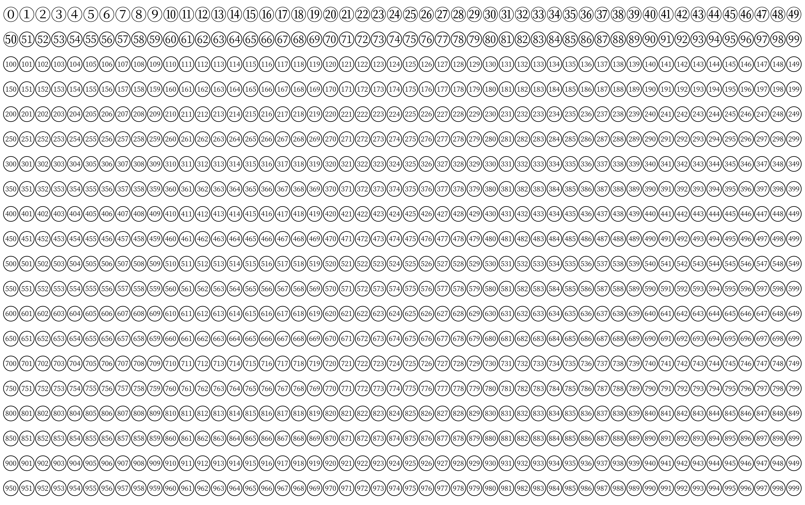

众所周知，$\LaTeX$ 提供了 `\textcircled` 命令用以给字符加圈，但效果却不怎么好：

{:.invert}

实际上，加圈并不是一个平凡的变换，它会涉及到圈内字符形状的微调，而这是几乎无法在 $\TeX$ 宏层面解决的。因此，要得到比较好的效果，最好能使用预先设计的字符形（glyph）。

## 传统方案

`pifont` 宏包提供了一系列[杂锦符号](https://en.wikipedia.org/wiki/Dingbat)（dingbats），其中就有带圈数字。`pifont` 属于 `psnfss` 宏集，它封装了一系列 PostScript 字体，包含著名的 Helvetica、Times、Courier 等。`pifont` 使用的是 [Zapf Dingbats](https://en.wikipedia.org/wiki/Zapf_Dingbats) 字体。

使用 `\ding{<number>}` 可以很方便地使用带圈数字（共有四种），当然也有其他符号。具体数字可参见下图：

{:.invert}

在主流的 $\TeX$ 引擎下，`pifont` 宏包都可以使用。

## Unicode

数字 0--50 的带圈版本都分配了对应的 Unicode 码位，因而在现代 $\TeX$ 引擎（$\>XeTeX$ 和 $\>LuaTeX$，若无特殊说明以下仅讨论这两者）中，配合合适的字体，理论上可以直接输入这些符号。具体见下表：[^font]

[^font]: 在本页面的 CSS 中，带圈数字将优先使用思源宋体（Source Han Serif）显示，但具体结果仍然取决于字体的安装情况以及浏览器的渲染方式。

{:.circled-number}
|  ⓪  |  ①  |  ②  |  ③  |  ④  |  ⑤  |  ⑥  |  ⑦  |  ⑧  |  ⑨  |  ⑩  |
| 24EA | 2460 | 2461 | 2462 | 2463 | 2464 | 2465 | 2466 | 2467 | 2468 | 2469 |
|      |  ⑪  |  ⑫  |  ⑬  |  ⑭  |  ⑮  |  ⑯  |  ⑰  |  ⑱  |  ⑲  |  ⑳  |
|      | 246A | 246B | 246C | 246D | 246E | 246F | 2470 | 2471 | 2472 | 2473 |
|      |  ㉑  |  ㉒  |  ㉓  |  ㉔  |  ㉕  |  ㉖  |  ㉗  |  ㉘  |  ㉙  |  ㉚  |
|      | 3251 | 3252 | 3253 | 3254 | 3255 | 3256 | 3257 | 3258 | 3259 | 325A |
|      |  ㉛  |  ㉜  |  ㉝  |  ㉞  |  ㉟  |  ㊱  |  ㊲  |  ㊳  |  ㊴  |  ㊵  |
|      | 325B | 325C | 325D | 325E | 325F | 32B1 | 32B2 | 32B3 | 32B4 | 32B5 |
|      |  ㊶  |  ㊷  |  ㊸  |  ㊹  |  ㊺  |  ㊻  |  ㊼  |  ㊽  |  ㊾  |  ㊿  |
|      | 32B6 | 32B7 | 32B8 | 32B9 | 32BA | 32BB | 32BC | 32BD | 32BE | 32BF |

Zapf Dingbats 中的其他几种样式也分配有码位：

- 反白（negative circled digits）

  {:.circled-number}
  |  ⓿  |  ❶  |  ❷  |  ❸  |  ❹  |  ❺  |  ❻  |  ❼  |  ❽  |  ❾  |  ❿  |
  | 24FF | 2776 | 2777 | 2778 | 2779 | 277A | 277B | 277C | 277D | 277E | 277F |
  |      |  ⓫  |  ⓬  |  ⓭  |  ⓮  |  ⓯  |  ⓰  |  ⓱  |  ⓲  |  ⓳  |  ⓴  |
  |      | 24EB | 24EC | 24ED | 24EE | 24EF | 24F0 | 24F1 | 24F2 | 24F3 | 24F4 |

- 无衬线（circled sans-serif digits）

  {:.circled-number}
  |   🄋  |  ➀  |  ➁  |  ➂  |  ➃  |  ➄  |  ➅  |  ➆  |  ➇  |  ➈  |  ➉  |
  | 1F10B | 2780 | 2781 | 2782 | 2783 | 2784 | 2785 | 2786 | 2787 | 2788 | 2789 |

- 无衬线反白（negative circled sans-serif digits）

  {:.circled-number}
  |   🄌  |  ➊  |  ➋  |  ➌  |  ➍  |  ➎  |  ➏  |  ➐  |  ➑  |  ➒  |  ➓  |
  | 1F10C | 278A | 278B | 278C | 278D | 278E | 278F | 2790 | 2791 | 2792 | 2793 |

此外，还额外增加了一些样式：

- 双线（double circled digits）

  {:.circled-number}
  |  ⓵  |  ⓶  |  ⓷  |  ⓸  |  ⓹  |  ⓺  |  ⓻  |  ⓼  |  ⓽  |  ⓾  |
  | 24F5 | 24F6 | 24F7 | 24F8 | 24F9 | 24FA | 24FB | 24FC | 24FD | 24FE |

- 加框（circled numbers on black square）

  {:.circled-number}
  |  ㉈  |  ㉉  |  ㉊  |  ㉋  |  ㉌  |  ㉍  |  ㉎  |  ㉏  |
  | 3248 | 3249 | 324A | 324B | 324C | 324D | 324E | 324F |

- 带圆括号（parenthesized digits）

  {:.circled-number}
  |  ⑴  |  ⑵  |  ⑶  |  ⑷  |  ⑸  |  ⑹  |  ⑺  |  ⑻  |  ⑼  |  ⑽  |
  | 2474 | 2475 | 2476 | 2477 | 2478 | 2479 | 247A | 247B | 247C | 247D |
  |  ⑾  |  ⑿  |  ⒀  |  ⒁  |  ⒂  |  ⒃  |  ⒄  |  ⒅  |  ⒆  |  ⒇  |
  | 247E | 247F | 2480 | 2481 | 2482 | 2483 | 2484 | 2485 | 2486 | 2487 |

- 带点（digits with full stop）

  {:.circled-number}
  |   🄀  |  ⒈  |  ⒉  |  ⒊  |  ⒋  |  ⒌  |  ⒍  |  ⒎  |  ⒏  |  ⒐  |  ⒑  |
  | 1F100 | 2488 | 2489 | 248A | 248B | 248C | 248D | 248E | 248F | 2490 | 2491 |
  |       |  ⒒  |  ⒓  |  ⒔  |  ⒕  |  ⒖  |  ⒗  |  ⒘  |  ⒙  |  ⒚  |  ⒛  |
  |       | 2492 | 2493 | 2494 | 2495 | 2496 | 2497 | 2498 | 2499 | 249A | 249B |

- 带逗号（digits with comma）

  {:.circled-number}
  |   🄁  |   🄂  |   🄃  |   🄄  |   🄅  |   🄆  |   🄇  |   🄈  |   🄉  |   🄊  |
  | 1F101 | 1F102 | 1F103 | 1F104 | 1F105 | 1F106 | 1F107 | 1F108 | 1F109 | 1F10A |

- 这些姑且也算上吧：

  {:.circled-number}
  |   ㈠  |   ㈡  |   ㈢  |  ㈣  |  ㈤  |  ㈥  |  ㈦  |  ㈧  |  ㈨  |  ㈩  |
  |  3220 |  3221 |  3222 | 3223 | 3224 | 3225 | 3226 | 3227 | 3228 | 3229 |
  |   ㊀  |   ㊁  |   ㊂  |  ㊃  |  ㊄  |  ㊅  |  ㊆  |  ㊇  |  ㊈  |  ㊉  |
  |  3280 |  3281 |  3282 | 3283 | 3284 | 3285 | 3286 | 3287 | 3288 | 3289 |
  |   🈩  |   🈔  |   🈪  |
  | 1F229 | 1F214 | 1F22A |
  |       |   🉂  |   🉁  |
  |       | 1F242 | 1F241 |

这些符号分散在以下几个 Unicode 区块（block）中：

- Enclosed Alphanumerics (`U+2460`--`U+24FF`)
  - 带圈 0--20（以及 a--z、A--Z）
  - 反白 0、11--20
  - 双线 1--10
  - 带圆括号 1--20
  - 带点 1--20
- Dingbats (`U+2700`--`U+27BF`)
  - 反白 1--10
  - 无衬线 1--10
  - 无衬线反白 1--10
- Enclosed CJK Letters and Months (`U+3200`--`U+32FF`)
  - 带圈 21--50
  - 加框 10--80（仅限整十）
  - 带圈 `一`～`十`
  - 带圆括号 `一`～`十`
- Enclosed Alphanumeric Supplement (`U+1F100`--`U+1F1FF`)
  - 带逗号 0--9
  - 无衬线、无衬线反白以及带点的 0
- Enclosed Ideographic Supplement (`U+1F200`--`U+1F2FF`)
  - 带方框 `一`、`二`、`三`
  - 带六角括号 `二`、`三`

直接输入，或者利用码位，都能在 $\LaTeX$ 中使用以上这些带圈数字（注意不同方法对大小写的要求有差异）：

```tex
\documentclass{article}
\usepackage{fontspec}
\setmainfont{Source Han Serif SC}

\begin{document}
① ② ③ ④ ⑤
\symbol{"2776} \symbol{"2777} \symbol{"2778} \symbol{"2779} \symbol{"277A}
\char"3248\    \char"3249\    \char"324A\    \char"324B\    \char"324C\
^^^^3280       ^^^^3281       ^^^^3282       ^^^^3283       ^^^^3284
^^^^^1f229     ^^^^^1f214     ^^^^^1f22a
\end{document}
```

使用 $\>XeLaTeX$ 或 $\>LuaLaTeX$ 编译，效果如下：

{:.invert}

## `xunicode-addon` 宏包

在实际使用中，无论是依靠码位，还是借由输入法直接录入这些特殊字符，都不是很方便。在 `xunicode-addon` 宏包（从属于 `xeCJK`）中，`\textcircled` 等一系列命令被重新定义，从而能够显示 Unicode 所分配的带圈数字（和字母等）。举例如下：

```tex
\documentclass{article}
\usepackage{fontspec,xunicode-addon}
\setmainfont{Source Han Serif SC}

\begin{document}
\textcircled{1}
\textcircled{25}
\textcircled{a}
\textcircled{Z}
\end{document}
```

利用 $\LaTeX3$ 语法也可以迅速写出如下循环而不伤身体：

```tex
\ExplSyntaxOn
\cs_set:Npn \TESTi
  {
    \int_step_inline:nnn {  0 } { 25 } { \textcircled{##1} ~ } \par
    \int_step_inline:nnn { 26 } { 50 } { \textcircled{##1} ~ } \par
  }
\cs_set:Npn \TESTii
  { \tl_map_inline:nn { abcdefghijklmnopqrstuvwxyz } { \textcircled{##1} ~ } \par }
\cs_set:Npn \TESTiii
  { \tl_map_inline:nn { ABCDEFGHIJKLMNOPQRSTUVWXYZ } { \textcircled{##1} ~ } \par }
\ExplSyntaxOff

\TESTi
\TESTii
\TESTiii
```

{:.invert}

当然，其他样式的带圈数字并没有提供快捷的输入方式。

## 在 `ctex` 宏集中使用

以上的案例都是在标准文档类 `article` 中搭配 `fontspec` 宏包完成的。如果切换成 `ctex` 宏集，则需要额外做一些调整。

对于中文文档，我们通常需要为中西文（「西文」主要指 Latin script）分别设置字体。上面已经提到过，带圈数字分散在了几个 Unicode 区块中。`xeCJK` 将其中的 Enclosed CJK Letters and Months 和 Enclosed Ideographic Supplement 设置为了 CJK 字符类，使用中文字体；其余则为 Default 字符类，使用西文字体。

$\>LuaTeX$ 下的情况类似，但稍显复杂。首先是 `luatexja` 作出了 ALchar 和 JAchar 的划分，大致相当于西文和日文（AL=**AL**phabetic，JA=**JA**panese）；同时又预定义了一些字符范围。默认设置中，上文所列的所有带圈数字均会使用日文字体。其后，`ctex` 宏集为了适应中文排版的需求又做了一些修改。结果是，Enclosed Alphanumerics 被设置为了 ALchar，即使用西文字体。

总而言之，在 `ctex` 宏集的默认配置下：

| Unicode 区块                     | $\>XeLaTeX$ | $\>LuaLaTeX$ |
|:--------------------------------:|:----------:|:-----------:|
| Enclosed Alphanumerics           | 西文       | 西文        |
| Dingbats                         | 西文       | 西文        |
| Enclosed CJK Letters and Months  | 中文       | 中文        |
| Enclosed Alphanumeric Supplement | 西文       | 西文        |
| Enclosed Ideographic Supplement  | 中文       | 西文        |

在 $\>XeLaTeX$ 下，可以做如下修改：

```tex
% 使用中文字体
\xeCJKDeclareCharClass{CJK}{%
  "24EA,        % ⓪
  "2460->"2473, % ①->⑳
  "3251->"32BF, % ㉑->㊿
  "24FF,        % ⓿
  "2776->"277F, % ❶->❿
  "24EB->"24F4  % ⓫->⓴
}
\setCJKmainfont{Source Han Serif SC}

% 或使用西文字体
% \xeCJKDeclareCharClass{Default}{%
%   "24EA, "2460->"2473, "3251->"32BF,
%   "24FF, "2776->"277F, "24EB->"24F4}
% \setmainfont{Garamond-Math.otf}
```

在 $\>LuaLaTeX$ 下，也完全类似：

```tex
% 使用中文字体
\ltjdefcharrange{6}{%
  "24EA, "2460-"2473, "3251-"32BF,
  "24FF, "2776-"277F, "24EB-"24F4}
\setCJKmainfont{Source Han Serif SC}

% 或使用西文字体
% \ltjdefcharrange{3}{%
%   "24EA, "2460-"2473, "3251-"32BF,
%   "24FF, "2776-"277F, "24EB-"24F4}
% \setmainfont{Garamond-Math.otf}
```

这里的 `6` 和 `3` 原先分别对应日文字符和西文标点、符号。还需注意范围的写法与 `xeCJK` 中不同。

配合 `xunicode-addon` 宏包，在 `ctex` 宏集中也同样可以使用 `\textcircled` 命令输入预定义的带圈数字。但需注意，`\textcircled` 会预先检查字符是否存在，且仅在西文字体中进行。所以如需使用中文字体进行显示，就要「指鹿为马」：[^textcircled-ctex]

[^textcircled-ctex]: 感谢 [@qinglee](https://github.com/qinglee) 的指导！见 CTeX-org/ctex-kit [#399](https://github.com/CTeX-org/ctex-kit/issues/399)。

```tex
% XeLaTeX 下需要把全体带圈数字都设置成 Default 类
% LuaLaTeX 下无须额外设置
\xeCJKDeclareCharClass{Default}{"24EA, "2460->"2473, "3251->"32BF}

% 将中文字体声明为（西文）字体族
\newfontfamily\EnclosedNumbers{Source Han Serif SC}

% 放置钩子，只让带圈字符才需更换字体
\AtBeginUTFCommand[\textcircled]{\begingroup\EnclosedNumbers}
\AtEndUTFCommand[\textcircled]{\endgroup}
```

对于字体中没有的带圈数字，`\textcircled` 也能够自动生成（由圆圈和相应的数字拼合）。选择合适的字体之后，便可做一些比较暴力的尝试：

{:.invert}

即使是三位数，效果也尚能接受。

## OpenType 的 `nalt` 特性

在 OpenType 中，有一项名为 [`nalt`](https://docs.microsoft.com/typography/opentype/spec/features_ko#nalt)（Alternate Annotation Forms）的 GSUB 特性，它的作用是把特定的字符形替换成符号标注形式（notational forms）。不少日文字体都包含这一特性，我们可以利用 `fontspec` 宏包提供的相关选项调用。举例如下：

```tex
\documentclass{article}
\usepackage{fontspec}
\setmainfont{ipaexm.ttf}  % IPAex 明朝，TeX Live 自带

\begin{document}
{\addfontfeature{Annotation=0}123456789}
{\addfontfeature{Annotation=1}123456789}
{\addfontfeature{Annotation=2}123456789}
\end{document}
```

{:.invert}

需要注意的是，`Annotation=X` 中的某个 `X` 具体对应何种样式，这是由字体设计者决定的。此外，在一些字体中，部分假名、汉字也有类似的标注形式，可以用相同方法使用：

```tex
\documentclass{ctexart}
\setCJKmainfont{Hiragino Mincho Pro W3}

\begin{document}
{\addCJKfontfeature{Annotation=0}あア}
{\addCJKfontfeature{Annotation=1}かカ}
{\addCJKfontfeature{Annotation=2}さサ}
{\addCJKfontfeature{Annotation=3}たタ}
{\addCJKfontfeature{Annotation=4}なナ}
{\addCJKfontfeature{Annotation=5}はハ}
{\addCJKfontfeature{Annotation=6}まマ}
\end{document}
```

{:.invert}

这里我们用 `\addCJKfontfeature` 代替了 `\addfontfeature`。此处作为演示的字体是 macOS 自带的<span lang="ja">ヒラギノ明朝</span>，在 Windows/Linux 上可换用其他字体。

## Adobe-Japan1-7

[Adobe-Japan1-7 字符集](https://github.com/adobe-type-tools/Adobe-Japan1)定义了更多的带圈数字，很多样式都支持 0--100 的数字范围。但由于 Unicode 没有为它们分配码位，我们必须用 CID（**C**haracter **ID**entifier）来指定。[^cid]

[^cid]: 感谢 [@clerkma](https://github.com/clerkma) 的指导！见 CTeX-org/forum [#20](https://github.com/CTeX-org/forum/issues/20)。

由于 CID 到具体字符的映照比较复杂，因而这里我们提供了一个宏包 [`textcircle-cid`](https://github.com/stone-zeng/latex-showcase/blob/main/textcircle-cid/textcircle-cid.sty)，用来通过 CID 调用带圈数字。`textcircle-cid` 宏包提供了下面一组命令：

- `\CIDtextcircled`
- `\CIDtextblackcircled`
- `\CIDtextboxed`
- `\CIDtextblackboxed`
- `\CIDtextrboxed`
- `\CIDtextblackrboxed`

支持的数字范围是 0--100 和 00--09。$\>XeTeX$、$\>LuaTeX$ 和 $\>upTeX$ 这三种 Unicode 引擎均可使用，但需要配合其他宏包及命令以实现正确的字体调用：

- $\>XeLaTeX$ 下需要通过 `\setmainfont` 等命令设置字体
- $\>LuaLaTeX$ 下需要通过 `\setmainjfont` 等命令设置（日文）字体
- $\>upLaTeX$ 下需要调用 `pxchfon` 宏包，并且使用 `\setminchofont` 等命令设置字体，具体可以参考以下示例：

  ```tex
  % test-uptex.tex
  \documentclass{ujarticle}
  \usepackage{pxchfon,textcircle-cid}
  \setminchofont{KozMinPr6N-Regular.otf}
  \setgothicfont{KozGoPr6N-Regular.otf}

  \def\TEST{%
    \CIDtextcircled{0}
    \CIDtextblackcircled{1}
    \CIDtextboxed{00}
    \CIDtextblackboxed{10}
    \CIDtextrboxed{50}
    \CIDtextblackrboxed{100}}

  \begin{document}
  \textmc{\TEST} \par
  \textgt{\TEST}
  \end{document}
  ```

  {:.invert}

  注意 $\>upTeX$ 不直接生成 PDF，因此编译时可采取如下方式：

  ```bash
  uplatex test-uptex && dvipdfmx test-uptex
  ```

  在上面的示例中，我们使用的字体是 Adobe 的<span lang="ja">小塚明朝</span>和<span lang="ja">小塚ゴシック</span>。事实上，只有遵从 Adobe-Japan1 的字体，才能利用 CID 正确地调用相应的字符。

## 字体的选择

上文我们多次提及，带圈数字的具体使用与字体密切相关。下面我们整理了 $\TeX$ Live 自带的、可使用带圈数字的字体，以及对应的数字范围：

{:.circled-number-fonts}
| 字体                                                            | 带圈   | 反白   | 无衬线 | 无衬线反白 |
|:---------------------------------------------------------------:|:------:|:------:|:------:|:----------:|
| Baekmuk Fonts 系列                                              | 1--15  |        |        |            |
| Carlito                                                         | 0--20  | 0--20  |        |            |
| DejaVuSans                                                      | 1--10  | 1--10  | 1--10  | 1--10      |
| Fandol Song/Hei/Fang/Kai                                        | 1--10  |        |        |            |
| FreeMono, FreeSans                                              | 1--10  |        |        |            |
| FreeSerif                                                       | 1--10  | 1--10  | 1--10  | 1--10      |
| Garamond Math                                                   | 0--50  | 0--20  |        |            |
| IPAGothic, IPAMincho                                            | 1--50  | 1--20  |        |            |
| Junicode                                                        | 0--20  | 0--20  |        |            |
| Lato                                                            | 0--20  | 0--20  |        |            |
| Libertinus Serif/Sans/Math<br>Linux Libertine<br>Linux Biolinum | 0--20  | 0--20  |        |            |
| Libertinus Keyboard<br>Linux Biolinum Keyboard                  |        | 1--10  |        |            |
| STIX, STIX Math                                                 | 0--9   |        | 1--10  | 1--10      |
| STIX Two Math                                                   | 0--20  | 0--20  | 1--10  | 1--10      |
| Un-Fonts 系列（UnBatang 等）                                    | 0--20  |        |        |            |
| XITS, XITS Math                                                 | 0--9   |        | 1--10  | 1--10      |
| 文鼎ＰＬ简报宋<br>文鼎ＰＬ简中楷                                | 1--10  |        |        |            |

以下是其他一些常见中、日文字体，其中很多是操作系统自带的：

{:.circled-number-fonts}
| 字体                                                                                                   | 带圈   | 反白   | 无衬线 | 无衬线反白 |
|:------------------------------------------------------------------------------------------------------:|:------:|:------:|:------:|:----------:|
| 思源宋体、思源黑体                                                                                     | 0--50  | 0--20  | 0--10  | 0--10      |
| 微软雅黑、微软正黑                                                                                     | 1--10  |        |        |            |
| 苹方                                                                                                   | 0--50  | 0--20  | 0--10  | 1--10      |
| 方正书宋、方正黑体、方正楷体、方正仿宋、等线                                                           | 1--10  |        |        |            |
| 宋体、黑体、楷体、仿宋（中易）                                                                         | 1--10  |        |        |            |
| 更纱黑体 (Sarasa Gothic)                                                                               | 0--50  | 0--20  | 0--10  | 0--10      |
| <span lang="ja">小塚明朝</span> (Kozuka Mincho)<br><span lang="ja">小塚ゴシック</span> (Kozuka Gothic) | 0--100 | 0--100 |        |            |
| <span lang="ja">游明朝</span> (Yu Mincho)<br><span lang="ja">游ゴシック</span> (Yu Gothic)             | 0--100 | 0--100 |        |            |
| <span lang="ja">メイリオ</span> (Meiryo)                                                               | 0--50  | 1--20  | 0--10  | 1--10      |

这里我们用了 Python 脚本 [`check-circled-number.py`](https://github.com/stone-zeng/latex-showcase/blob/main/textcircle-cid/check-circled-number.py) 来读取字体信息，它还依赖 [FontForge](https://fontforge.github.io/)。注意由于字体版本不同，不保证表中所列结果与实际情况完全一致。

## 注释

<div id="footnotes"></div>
