$$
\gdef\id{\mathrm{id}}
\gdef\tr{\operatorname{tr}}
\gdef\Hom{\operatorname{Hom}}
\gdef\End{\operatorname{End}}
\gdef\1{\mathbf{1}}
\gdef\cat#1{\mathcal{#1}}
\gdef\Cat#1{\textsf{\textbf{#1}}}
\gdef\qtext#1{\enspace\text{#1}\enspace}
\gdef\ldual#1{ {}^\vee\mkern{-2mu}#1}
$$
{:.katex-def}

Category theory formalizes many mathematical structures, especially the mapping between "objects". A modular tensor category is a category with some extra structures and can provide the mathematical foundation of some physical concepts, especially the topological orders.

In the first part of this note, we will introduce some basic ideas of category theory. For people with programming backgrounds (or just interested in it), we will use Haskell as an example. Then some more structures will be added into the "bare" category, such as tensor product, braiding and dual. These will be helpful when we deal with modular tensor category in the next part, although some physicists may complain that they are too tedious.

## Basic knowledge of categories

### Category

A **category** $\cat{C}$ consists of

- **Objects**: $x\in\cat{C}$
- **Morphisms**: $f\colon x\to y$ or more precisely $f\in\Hom_\cat{C}(x,y)$. We call $\Hom_\cat{C}(x,y)$ the *hom-set* and $x$ and $y$ *domain* and *codomain* respectively
- If we have two morphisms $f\colon x\to y$ and $g\colon y\to z$, then there exists the **composition** of morphisms $g\circ f\colon x\to z$

and the following axioms should hold:

- **Associativity**: for $f\colon x\to y$, $g\colon y\to z$ and $h\colon z\to w$, their composition should satisfy

  $$ (h\circ g)\circ f = h\circ(g\circ f) $$

- **Identity**: $\forall x\in\cat{C}$, there exists an identity morphism $\id_x\colon x\to x$ such that

  $$ f\circ \id_x = \id_y\circ f = f, \quad \forall f\colon x\to y$$

In a pictorial representation, the morphism in a category can be visualized as a "black box":

<!-- {:.invert}{:style="max-width: 210px;"} -->
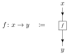

For identity morphism $\id_x$, the box can be omitted:

<!-- {:.invert}{:style="max-width: 160px;"} -->
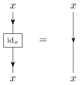

For the composition of two morphisms $f$ and $g$, we use two consecutive boxes:

<!-- {:.invert}{:style="max-width: 180px;"} -->
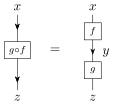

In our convention, these diagrams should be read *from top to bottom*, as the arrows indicate. The direction will be significant when we meet the dual of objects (see below).

There are some special cases of morphisms. Let $f\colon x\to y$, then

- $f$ is a **monomorphism** if for all morphisms $g_1, g_2\colon w\to x$, $f\circ g_1=f\circ g_2\implies g_1=g_2$ (left cancellable)
- $f$ is an **epimorphism** if for all morphisms $h_1, h_2\colon y\to z$, $h_1\circ f=h_2\circ f\implies h_1=h_2$ (right cancellable)
- $f$ is an **isomorphism** if there exists $f^{-1}\colon y\to x$ such that $f^{-1}\circ f=\id_x$ and $f\circ f^{-1}=\id_y$. Here, $f^{-1}$ is called the **inverse** of $f$
- If the domain and codomain of $f$ coincide, i.e. $f\in\Hom_\cat{C}(x,x)\coloneqq\End_{\cat{C}}(x)$, then $f$ is an **endomorphism**
- If $f$ is both an endomorphism and an isomorphism, then it's called an **automorphism**

<!--
Clearly, the composition of two endomorphisms is still an endomorphism. So the set of all endomorphisms of $x$ form a *monoid* $\operatorname{End}_{\cat{C}}(x)$:
  - $\id_x$ corresponds to the identity element in the monoid
  - Composition of corresponds to the multiplication in the monoid with the associativity axiom
-->

To better understand the abstract idea of category, objects and morphisms, we give some concrete examples:

| Categories | Objects            | Morphisms           |
|:----------:|:------------------:|:-------------------:|
| **Set**    | sets               | functions           |
| **Grp**    | groups             | group homomorphisms |
| **Top**    | topological spaces | continuous maps     |
| **Vec**    | vector spaces      | linear maps         |
| **Hask**   | Haskell types      | pure functions      |

### Functor

A **functor** $F\colon \cat{C}\to\cat{D}$ is a map between two categories such that

- Object $x\in\cat{C}$ maps to object $F(x)\in\cat{D}$
- Morphism $f\in\Hom_\cat{C}(x,y)$ maps to $F_f\in\Hom_\cat{D}(F(x),F(y))$

where $F$ preserves

- Identity:

  $$ F_{\id_x} = \id_{F(x)} \in \Hom_\cat{D}(F(x),F(x)), \quad \forall x\in\cat{C} $$

- Composition:

  $$ F_{g\circ f} = F_g\circ F_f \in \Hom_\cat{D}(F(x),F(z)), \quad \forall f\in\Hom_\cat{C}(x,y), \, g\in\Hom_\cat{C}(y,z) $$

In Haskell, a functor is defined as a **type class**:

```haskell
class Functor f where
    fmap :: (a -> b) -> f a -> f b
```

The two laws that a functor should obey are then:

```haskell
fmap id      == id               -- Preserve identities
fmap (f . g) == fmap f . fmap g  -- Preserve composition
```

Let's see an example. First, we have a function that converts an integer to a string:

```haskell
show :: Int -> String
```

Then we have the `List` (or `[]`) functor, which maps the **Hask** category to **Lst** (a subcategory of **Hask** that contains all the list types):

```haskell
instance Functor [] where
    fmap = ...
```

Therefore `fmap show` is a function (i.e. morphism) in **Lst** that converts a list of integers to a list of strings.

### Natural transformation

Given two functors $F\colon \cat{C}\to\cat{D}$ and $G\colon \cat{C}\to\cat{D}$, a **natural transformation** (aka. functorial morphism) $\tau\colon F\Rightarrow G$ is defined with its *component* $\tau_x$ (a morphism in $\cat{D}$):

$$ \tau_x\colon F(x)\to G(x), \quad \forall x\in\cat{C} $$

such that

$$ \tau_y\circ F_f = G_f\circ\tau_x, \quad \forall f\in\Hom_\cat{C}(x,y) $$

In a pictorial representation, that is to say the following diagram is *commutative*, i.e. the two paths from $F(x)$ to $G(y)$ are equivalent:

<!-- {:.invert}{:.tikz-cd}{:style="max-width: 250px;"} -->
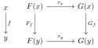

or more complicated:

<!-- {:.invert}{:.tikz-cd}{:style="max-width: 400px;"} -->
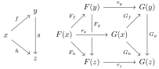

Natural transformation itself is usually denoted as a double arrow:

<!-- {:.invert}{:.tikz-cd}{:style="max-width: 150px;"} -->


A natural transformation $\tau$ with every component $\tau_x$ invertible is called a **natural isomorphism**. In such case, we can automatically define the natural transformation $\tau^{-1}$ with components $\tau^{-1}_x\colon G(x)\to F(x)$ such that

$$ \tau^{-1}_x\circ\tau_x = \id_{F(x)}, \quad \tau_x\circ\tau^{-1}_x = \id_{G(x)} $$

In Haskell, natural transformation is given by **parametric polymorphic functions**, such as

```haskell
natTrans :: forall a . F a -> G a
```

where `a` is the type parameter, while `F` and `G` are two functors (i.e. type classes which are instances of `Functor`).

To give a concrete example, we will implement a "safe" version of `head`. In Haskell Prelude, `head` is a function that returns the first item of a list:

```haskell
head :: [a] -> a
head (x:xs) = x
```

So clearly `head [1,2,3]` gives `1`. But it will throw an exception when applied on an empty list:

```haskell
> head []
*** Exception: Prelude.head: empty list
```

We can use `Maybe` (similar to `std::option<T>` in C++ and `Option<T>` in Rust) as a wrapper to avoid such exception:

```haskell
safeHead :: [a] -> Maybe a
safeHead []     = Nothing
safeHead (x:xs) = Just x
```

Here `safeHead` is a polymorphic function, or natural transformation in category theory's language, that maps from `[]` functor to `Maybe` functor. Note that, however, the `safeHead` function may [break the free theorem for `fmap`](https://stackoverflow.com/a/6364990/).

## Tensor category

Roughly speaking, a tensor category (or monoidal category) is a category with a "tensor product". A basic example is the vector space (or the category **Vec**), where the tensor product is defined as the combination of two vector spaces, as well as the linear maps over them.

The formal definition requires some other concepts:

- For categories $\cat{C}$ and $\cat{C}^\prime$, their **Cartesian product** $\cat{C}\times\cat{C}^\prime$ is also a category where

  - Object is a pair $(x,x^\prime)$
  - Morphism is $(f,f^\prime)\colon(x,x^\prime)\to(y,y^\prime)$
  - Identity is $\id_{(x,x^\prime)}\coloneqq(\id_x,\id_{x^\prime})\colon(x,x^\prime)\to(x,x^\prime)$
  - Composition is $(g,g^\prime)\circ(f,f^\prime)\coloneqq(g\circ f,g^\prime\circ f^\prime)$

- A **bifunctor** $F\colon\cat{C}\times\cat{C}^\prime\to\cat{D}$ is a map such that

  - Object $(x,x^\prime)\in\cat{C}\times\cat{C}^\prime$ maps to object $F(x,x^\prime)\in\cat{D}$
  - Morphism $(f,f^\prime)\in\Hom_{\cat{C}\times\cat{C}^\prime}\bigl((x,x^\prime),(y,y^\prime)\bigr)$ maps to $F_{(f,f^\prime)}\in\Hom_\cat{D}\bigl(F(x,x^\prime),F(y,y^\prime)\bigr)$
  - The identity and composition are preserved just as in a normal functor

Now we can define the **tensor category** $\cat{C}$ with

- **Tensor product**, which is a bifunctor $\otimes\colon\cat{C}\times\cat{C}\to\cat{C}$
- A **unit object** $\1\in\cat{C}$
- **Associator** $\alpha$, which is a natural isomorphism:
  $$ \alpha_{x,y,z} \colon (x\otimes y)\otimes z \overset\sim\to x\otimes(y\otimes z), \quad \forall x,y,z \in \cat{C} $$
- **Left unitor** $\lambda$ and **right unitor** $\rho$, which are natural isomorphisms with
  $$ \lambda_x \colon \1\otimes x \overset\sim\to x, \quad \rho_x \colon x\otimes\1 \overset\sim\to x, \quad \forall x \in \cat{C} $$

such that the following two diagrams commute:

- Triangle equation:

  <!-- {:.invert}{:.tikz-cd}{:style="max-width: 360px;"} -->
  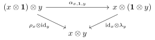

- Pentagon equation:

  <!-- {:.invert}{:.tikz-cd}{:style="max-width: 560px;"} -->
  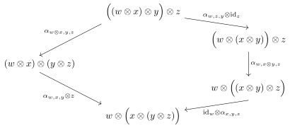

In the above definition, we use "$\overset\sim\to$" to denote the natural isomorphism. If "$\overset\sim\to$" becomes "$=$", then we call the tensor category **strict**. In such case, $\alpha_x$, $\lambda_x$ and $\rho_x$ become identity isomorphisms.

MacLane gives the following important result:

> **Coherence theorem:**\\
> *Every tensor category is (tensor) equivalent to a strict one.*

The name *tensor category* is very intuitive, as we have just equipped the category with a *tensor* product. The alternate name *monoidal category* is not so straight forward, but it indicates a remarkable fact: a strict monoidal category is indeed a *monoid* (i.e. a "group" without invertibility):

- Tensor product $\otimes$ corresponds to the multiplication in the monoid with the associativity axiom
- Unit object $\1$ corresponds to the identity element in the monoid

## Braided tensor category

In physics, we use "exchange" to describe the process of moving two systems around each other, such as the exchange of two fermions/bosons. In category theory, we call it "braiding".

A **braided tensor category** (or braided tensor category, BTC) $\cat{C}$ is a tensor category with a natural isomorphism

$$ \sigma_{x,y} \colon x\otimes y \overset\sim\to y\otimes x, \quad \forall x,y \in \cat{C} $$

such that the following diagrams (hexagon equations) commute:

<!-- {:.invert}{:.tikz-cd}{:style="max-width: 540px;"} -->
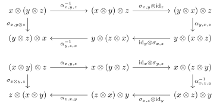

In the graphical notation, $\sigma$ and its inverse can be visualized as

<!-- {:.invert}{:style="max-width: 480px;"} -->
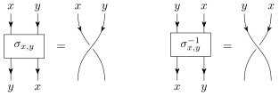

Then it can be easily shown that $\sigma_{x,y}^{-1}\circ\sigma_{x,y}=\sigma_{y,x}\circ\sigma_{y,x}^{-1}=\id_{x\otimes y}$, as they are *topologically* equivalent:

<!-- {:.invert}{:style="max-width: 300px;"} -->
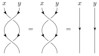

The hexagon equations become apparent as well:

<!-- {:.invert}{:style="max-width: 560px;"} -->
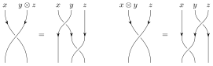

Furthermore, we can find the following important identities via the graphical calculus:

- $\sigma_{x^\prime,y^\prime}\circ(f\otimes g) = (g\otimes f)\circ\sigma_{x,y}, \quad \forall f\in\Hom_\cat{C}(x,x^\prime), \, g\in\Hom_\cat{C}(y,y^\prime)$

  <!-- {:.invert}{:style="max-width: 250px;"} -->
  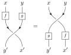

- $(\sigma_{y,z}\otimes\id_x) \circ (\id_y\otimes\sigma_{x,z}) \circ (\sigma_{x,y}\otimes\id_z) = (\id_z\otimes\sigma_{x,y}) \circ (\sigma_{x,z}\otimes\id_y) \circ (\id_x\otimes\sigma_{y,z})$, which is called the *Yang--Baxter equation*

  <!-- {:.invert}{:style="max-width: 270px;"} -->
  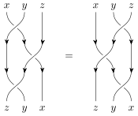

A braided tensor category is called **symmetric**, if $\sigma_{y,x}\circ\sigma_{x,y}=\id_{x\otimes y}$, or equivalently $\sigma_{x,y}=\sigma_{y,x}^{-1}$, just as the following diagram:

<!-- {:.invert}{:style="max-width: 480px;"} -->
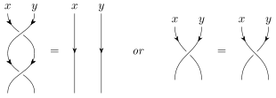

In braided tensor categories, a compatible functor requires some more constraints. Let $\cat{C}_1$ and $\cat{C}_2$ be braided tensor categories, then a **tensor functor** from $\cat{C}_1$ to $\cat{C}_2$ is defined as a pair $(F,\mu)$ where

- $F\colon\cat{C}_1\to\cat{C}_2$ is a functor
- $\mu_{x,y}\colon F(x\otimes y)\overset\sim\to F(x)\otimes F(y)$ is a natural isomorphism in $\cat{C}_2$, with $x,y\in\cat{C}_1$

such that the following conditions are satisfied:

- For associativity isomorphisms

  $$
  \begin{aligned}
    \alpha_{1;\,x,y,z}          &\colon (x\otimes y)\otimes z \overset\sim\to x\otimes(y\otimes z) \\
    \alpha_{2;\,F(x),F(y),F(z)} &\colon [F(x)\otimes F(y)]\otimes F(z) \overset\sim\to F(x)\otimes[F(y)\otimes F(z)], \quad \forall x,y,z \in \cat{C}_1
  \end{aligned}
  $$

  in $\cat{C}_1$ and $\cat{C}_2$ respectively, we have

  $$ F_{\alpha_{1;\,x,y,z}} = \alpha_{2;\,F(x),F(y),F(z)} \qtext{or simply} F_{\alpha_1}=\alpha_2, \quad \forall x,y,z \in \cat{C}_1 $$

  by using natural isomorphism $\mu$;

- Similar to associativity, but for braiding isomorphisms

  $$
  \begin{aligned}
    \sigma_{1;\,x,y}       &\colon x\otimes y \overset\sim\to y\otimes x \\
    \sigma_{2;\,F(x),F(y)} &\colon F(x)\otimes F(y) \overset\sim\to F(y)\otimes F(x), \quad \forall x,y \in \cat{C}_1
  \end{aligned}
  $$

  in $\cat{C}_1$ and $\cat{C}_2$ respectively, we have

  $$ F_{\sigma_{1;\,x,y}} = \sigma_{2;\,F(x),F(y)} \qtext{or simply} F_{\sigma_1}=\sigma_2, \quad \forall x,y \in \cat{C}_1 $$

  still by using $\mu$.

For a tensor category $\cat{C}$ (not necessarily braided), its **Drinfeld center** $\cat{Z}(\cat{C})$ is defined by another tensor category whose

- Object is a pair $(x,\phi^{(x)})$, where $x\in\cat{C}$ is an object and $\phi^{(x)}$ is a natural isomorphism:

  $$ \phi^{(x)}_y \colon x\otimes y \overset\sim\to y\otimes x $$

  such that

  $$ \phi^{(x)}_{y\otimes z} = (\id_y\otimes\phi^{(x)}_z) \circ (\phi^{(x)}_y\otimes\id_x), \quad \forall y,z\in\cat{C} $$

- Morphism $f\colon(x,\phi^{(x)})\to(y,\phi^{(y)})$ is a morphism $f\colon x\to y$ in $\cat{C}$ such that

  $$ (\id_z\otimes f)\circ\phi^{(x)}_z = \phi^{(y)}_z\circ(f\otimes\id_z), \quad \forall z\in\cat{C} $$

- Tensor product is

  $$ (x,\phi^{(x)})\otimes(y,\phi^{(y)}) = \left( x\otimes y, \, (\phi^{(x)}\otimes\id_y)\otimes(\id_x\otimes\phi^{(y)}) \right) $$

The Drinfeld center $\cat{Z}(\cat{C})$ is naturally a *braided* tensor category, with braiding isomorphism given by

$$ \sigma_{(x,\phi^{(x)}),\,(y,\phi^{(y)})} \colon (x,\phi^{(x)})\otimes(y,\phi^{(y)}) \to (y,\phi^{(y)})\otimes(x,\phi^{(x)}) $$

## Ribbon category

### Dual

Let's introduce the concept of **dual** in a tensor category first. This is a generalization of the dual vector space: for a vector space $V$ over field $F$, its dual space $V^\vee$ is defined as the set of all linear maps $\phi\colon V\to F$.

The **right dual** of an object $x\in\cat{C}$ is an object $x^\vee$ with two morphisms:

$$ e_x\colon x^\vee\otimes x\to\1, \quad i_x\colon\1\to x\otimes x^\vee $$

such that the composition $(\id_x\otimes e_x)\circ(i_x\otimes\id_x)=\id_x$:

$$
x \xrightarrow{i_x\otimes\id_x} (x\otimes x^\vee)\otimes x = x\otimes(x^\vee\otimes x)
  \xrightarrow{\id_x\otimes e_x} x\otimes\1 = x
$$

and $(e_x\otimes\id_{x^\vee})\circ(\id_{x^\vee}\otimes i_x)=\id_{x^\vee}$:

$$
x^\vee \xrightarrow{\id_{x^\vee}\otimes i_x} x^\vee\otimes(x\otimes x^\vee) = (x^\vee\otimes x)\otimes x^\vee
    \xrightarrow{e_x\otimes\id_{x^\vee}} \1\otimes x^\vee = x^\vee
$$

The above conditions are called **rigidity axioms**. In some sense, $e_x$ and $i_x$ are called *annihilation* and *creation* morphisms, as they can annihilate/create objects to/from "vacuum", just as the $\hat{a}$ and $\hat{a}^\dagger$ operators in quantum mechanics.

Similarly, we can define the **left dual** with the following morphisms:

$$ e'_x \colon x\otimes \ldual{x}\to\1, \quad i'_x\colon \1\to\ldual{x}\otimes x $$

and similar rigidity axioms. By definition, if $x$ is the right dual of $y$, then $y$ is the left dual of $x$, and vice versa. For a tensor category $\cat{C}$, if every object $x\in\cat{C}$ has left/right dual, then $\cat{C}$ is called **left/right rigid**. If both types of duals exist, then it's called **rigid** (or autonomous).

In the graphical notation, the dual of an object is represented by simply reversing the arrow. In addition, the unit object $\1$, or "vacuum", can be neglected. So $e_x$ and $i_x$ correspond to the following diagrams:

<!-- {:.invert}{:style="max-width: 680px;"} -->
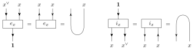

The rigidity axioms (for right dual) then become

<!-- {:.invert}{:style="max-width: 400px;"} -->
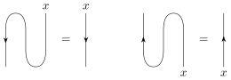

It can be shown that $\Hom_\cat{C}(x,y)$ is isomorphic to $\Hom_\cat{C}(y^\vee,x^\vee)$, therefore for every morphism $f\in\Hom_\cat{C}(x,y)$, we can define the dual as its image $f^\vee\in\Hom_\cat{C}(y^\vee,x^\vee)$:

$$ f^\vee \coloneqq (e_y\otimes\id_x) \circ (\id_{y^\vee}\otimes f\otimes\id_{x^\vee}) \circ (\id_{y^\vee}\otimes i_x) $$

or in the graphical notation:

<!-- {:.invert}{:style="max-width: 360px;"} -->
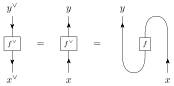

If combining the dual with tensor and braiding structures, we can then find some important identities:

- $(x\otimes y)^\vee = y^\vee\otimes x^\vee$

  <!-- {:.invert}{:style="max-width: 300px;"} -->
  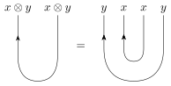

- $(e_y\otimes\id_x)\circ\sigma_{x,y^\vee\otimes y} = \sigma_{x,\1}\circ(\id_x\otimes e_y)$

  <!-- {:.invert}{:style="max-width: 270px;"} -->
  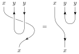

- $e_{x\otimes y} = (e_x\otimes e_y)\circ(\sigma_{y^\vee,x^\vee\otimes x}\otimes\id_y)$

  <!-- {:.invert}{:style="max-width: 300px;"} -->
  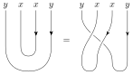

- $i_{x\otimes y} = (\id_x\otimes\sigma_{x^\vee,y^\vee\otimes y})\circ(i_x\otimes i_y)$

  <!-- {:.invert}{:style="max-width: 300px;"} -->
  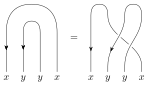

- $e_y\circ(\id_{y^\vee}\otimes f) = e_x\circ(f^\vee\otimes\id_x), \quad (f\otimes\id_{x^\vee})\circ i_x = (\id_y\otimes f^\vee)\circ i_y$

  <!-- {:.invert}{:style="max-width: 420px;"} -->
  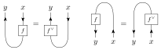

- $\sigma_{x,y}^\vee = \sigma_{x^\vee,y^\vee}$

  <!-- {:.invert} -->
  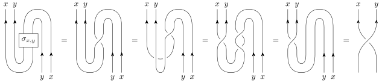{:.invert}

where $\sigma$ can be replaced by $\sigma^{-1}$ in these equations.

### Pivotal and spherical structure

For a finite-dimensional vector space $V$, we know that its double dual $V^{\vee\vee}$ is isomorphic to $V$. Its categorical generalization (over a right rigid category $\cat{C}$) is the **pivotal structure**, which is given by the following natural isomorphism:

$$ \delta_x \colon x \overset\sim\to x^{\vee\vee}, \quad \forall x\in\cat{C} $$

such that

$$
\delta_{x\otimes y} = \delta_x\otimes\delta_y, \quad
\delta_\1 = \id_\1, \quad
\delta_{x^\vee} = (\delta_x^\vee)^{-1}
$$

The definition of right dual gives

$$ e_x\colon x^\vee\otimes x^{\vee\vee}\to\1, \quad i_x\colon\1\to x^{\vee\vee}\otimes x^\vee $$

and therefore $x^{\vee\vee}$ is the left dual of $x^\vee$. By renaming $x^\vee$ to $y$, we can see that $\ldual{y}=y^\vee$.

In a pivotal category $\cat{C}$, a morphism $f\in\Hom_\cat{C}(x,y)$ will be identified with its double dual $f^{\vee\vee}\in\Hom_\cat{C}(x^{\vee\vee},y^{\vee\vee})\simeq\Hom_\cat{C}(x,y)$:

<!-- {:.invert}{:style="max-width: 200px;"} -->
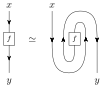

For an endomorphism $f\in\End_{\cat{C}}(x)$, where $\cat{C}$ is a pivotal category, we can define the left and right **(pivotal) traces** as

$$
\begin{aligned}
  \tr_{\text{L}} f &\colon \1 \xrightarrow{i_{x^\vee}} x^\vee\otimes x^{\vee\vee}
                              \xrightarrow{\id_{x^\vee}\otimes\delta_x^{-1}} x^\vee\otimes x
                              \xrightarrow{\id_{x^\vee}\otimes f} x^\vee\otimes x
                              \xrightarrow{e_x} \1 \\
  \tr_{\text{R}} f &\colon \1 \xrightarrow{i_x} x\otimes x^\vee
                              \xrightarrow{f\otimes\id_{x^\vee}} x\otimes x^\vee
                              \xrightarrow{\delta_x\otimes\id_{x^\vee}} x^{\vee\vee}\otimes x^\vee
                              \xrightarrow{e_{x^\vee}} \1
\end{aligned}
$$

In particular, when $f=\id_x$, we can define the left and right **dimension** of $x\in\cat{C}$ as

$$ \dim_{\text{L}}x\coloneqq\tr_{\text{L}}\id_x, \quad \dim_{\text{R}}x\coloneqq\tr_{\text{R}}\id_x $$

Note that the left/right trace is not the same thing as the left/right dual (we only use left dual in the definition, for example), as $\cat{C}$ is already pivotal.

The graphical representation of trace and dimension are the following:

<!-- {:.invert} -->
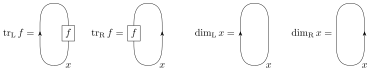{:.invert}

If the left and right traces of every endomorphism $f\in\End_{\cat{C}}(x)$ coincide, then $\cat{C}$ is called **spherical**.

### Ribbon

A **ribbon category** (or tortile category) is a braided pivotal category equipped with a **twist** (or balancing isomorphism):

$$ \theta_x \colon x \overset\sim\to x, \quad \forall x\in\cat{C} $$

such that the **balancing axioms** are satisfied:

$$
\theta_{x\otimes y} = \sigma_{y,x} \circ \sigma_{x,y} \circ (\theta_x\otimes\theta_y), \quad
\theta_\1 = \id_\1, \quad
\theta_{x^\vee} = \theta_x^\vee
$$

We can explicitly construct $\theta$ via the following natural isomorphism:

$$
\psi_x \colon x^{\vee\vee} \overset\sim\to x, \quad
\psi_x \coloneqq (\id_x\otimes e_{x^\vee}) \circ (\id_x\otimes\sigma_{x^{\vee\vee},x^\vee}^{-1}) \circ (i_x\otimes\id_{x^{\vee\vee}}), \quad
\forall x\in\cat{C}
$$

then

$$ \theta_x = \psi_x \circ \delta_x, \quad \forall x\in\cat{C} $$

The graphical notation of $\theta$ can be deduced from the definition of $\psi$, once we identify $x$ and $x^{\vee\vee}$ (i.e. simply ignore $\delta$):

<!-- {:.invert}{:style="max-width: 250px;"} -->
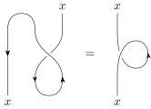

However, if imagining such thing as a 1-dimensional line or string in $\R^3$, then we may think that $\theta=\id$, which is not true in general. Therefore, we may turn to use a 2D object, or a "ribbon", to correctly represent $\theta$:

TODO:
<!-- {:.invert} -->

When trying to straighten it, we will get a ribbon with a "twist", and clearly it's not the same as a flat one. With such "ribbon" representation, the identity $\theta_{x\otimes y}=\sigma_{y,x}\circ\sigma_{x,y}\circ(\theta_x\otimes\theta_y)$ can be visualized as:

TODO:
<!-- {:.invert} -->

Every ribbon category admits a spherical structure. It can be seen from the following procedure:

TODO:
<!-- {:.invert} -->

## Summary

At the end of this part, we list of all the "ingredients" that can be added in a tensor category:

| Ingredients         | Meanings                    |
|:-------------------:|:---------------------------:|
| Tensor (monoidal)   | With tensor product         |
| Braided             | With braiding               |
| Symmetric           | Tensor product is symmetric |
| Rigid (autonomous)  | With left/right duals       |
| Pivotal (sovereign) | Left/right duals coincide   |
| Spherical           | Left/right traces coincide  |
| Ribbon (tortile)    | With twist                  |

## References

- Books:

  - S MacLane. *Categories for the Working Mathematician*
  - V G Turaev. *Quantum Invariants of Knots and 3-Manifolds*
  - B Bakalov, A Kirillov. [*Lectures on Tensor Categories and Modular Frunctor*](https://www.math.stonybrook.edu/~kirillov/tensor/tensor.html)
  - V Turaev, A Virelizier. *Monoidal Categories and Topological Field Theory*
  - B Milewski. [*Category Theory for Programmers*](https://bartoszmilewski.com/2014/10/28/category-theory-for-programmers-the-preface/)

- Papers:

  - A Kitaev. *Anyons in an exactly solved model and beyond*, [arXiv:cond-mat/0506438](https://arxiv.org/abs/cond-mat/0506438)
  - M Müger. *Tensor categories: A selective guided tour*, [arXiv:0804.3587](https://arxiv.org/abs/0804.3587)
  - J C Baez, M Stay. *Physics, Topology, Logic and Computation: A Rosetta Stone*, [arXiv:0903.0340](https://arxiv.org/abs/0903.0340)
  - P Bruillard, S H Ng, E C Rowell, Z Wang. *Rank-finiteness for modular categories*, [arXiv:1310.7050](https://arxiv.org/abs/1310.7050)
  - A Henriques, D Penneys, J Tener. *Categorified trace for module tensor categories over braided tensor categories*, [arXiv:1509.02937](https://arxiv.org/abs/1509.02937)
  - J Lou, C Shen, C Chen, L Y Hung. *A (Dummy's) Guide to Working with Gapped Boundaries via (Fermion) Condensation*, [arXiv:2007.10562](https://arxiv.org/abs/2007.10562)
  - D Aasen, P Fendley, R S K Mong. *Topological Defects on the Lattice: Dualities and Degeneracies*, [arXiv:2008.08598](https://arxiv.org/abs/2008.08598)

- Some other notes:

  - 张智浩. [日常的数学和物理问题](https://zhuanlan.zhihu.com/c_123465504)
  - M Thuresson. [*Drinfeld centers*](https://uu.diva-portal.org/smash/get/diva2:1205005/FULLTEXT01.pdf)
  - A large number of pages on [*n*Lab](https://ncatlab.org/)
  - TensorKit.jl. [*Optional introduction to category theory*](https://jutho.github.io/TensorKit.jl/stable/man/categories/)
