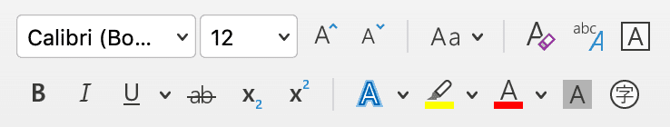
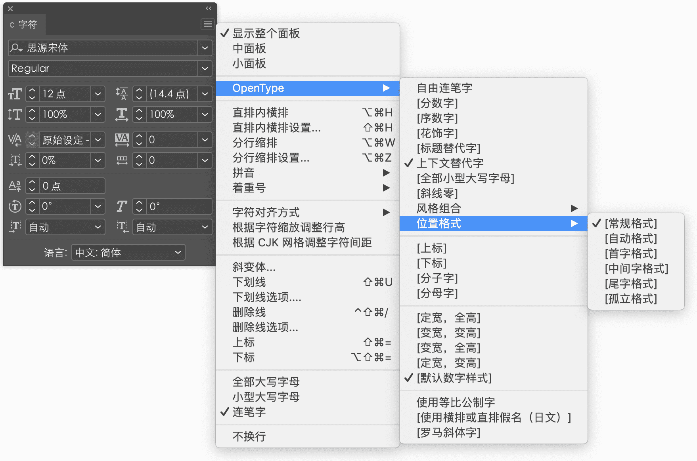
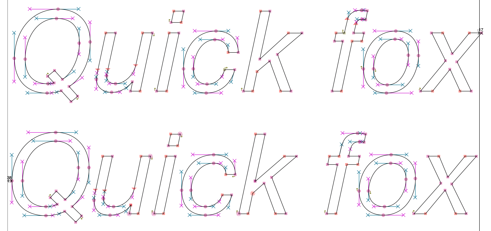

<script setup lang="ts">
import FontWeight from './FontWeight.vue'
</script>

在[上一回](./2018-08-08-use-opentype-fonts)中，我们介绍了字体的相关背景知识，并且给出了通过 `fontspec` 宏包使用 OpenType 字体的基本方法。这一篇我们将继续深入，讨论字体的各种样式。

<!-- more -->

## NFSS 简介

[NFSS](https://www.latex-project.org/help/documentation/fntguide.pdf) (New Font Selection Scheme)，即「新字体选择方案」，是 \LaTeXe 中的字体选择系统。按照 NFSS 的规定，\LaTeX 中的所有字体都要包含以下 5 种属性：

- 编码（encoding）：规定了字体中各个字符（character）出现的顺序，或者说，定义了一个从字符到字符形（glyph）的映照
- 族（family）：是我们通常所说的字体的名字，往往会涵盖多种变体，如 Computer Modern、Times New Roman、Source Han Sans 等
- 系列（series）：指字体的粗细、宽度，如中等粗细、窄体、加粗加宽等
- 形状（shape）：字体族中字母的式样，如直立、意大利体、倾斜、小型大写等
- 尺寸（size）：字体的设计尺寸，如 10pt

选择某种字体，就是在这 5 个「坐标」定义的「坐标系」中选择一个点，例如：

- `\OT1/cmr/m/n/10`：表示 Computer Modern Roman @ 10 point
- `\T1/ptm/b/it/1in`：表示 Adobe Times Bold Italic @ 1 inch
- `\OML/cmm/m/it/12pt`：表示 Computer Modern Math Italic @ 12 point

## 与 Word 的比较

对于刚接触 \LaTeX 的朋友来说，字体问题一定是一个大坑。在 Word 里面，选择字体只需在下拉菜单中选一下，加粗选「**B**」，倾斜选「<em><span class="slab-I">I</span></em>」，字号也可以很轻易地改为任意想要的数字。为什么 \LaTeX 就要制造这么多困难呢？

<figure>
  
  <figcaption>Word 中的字体面板</figcaption>
</figure>

一方面，人类的语言文字无比复杂，字体技术也必须有足够的规模才能够把它们支撑起来；另一方面，\TeX 和 \LaTeX 又太过古老，那个年代既没有 Unicode 也没有 OpenType，Word 也不知在哪里。此外，Word 作为字处理软件，隐藏了字体排印中的许多细节，相当于一部「能拍照的智能手机」；而 \TeX 则是一部「全功能单反相机」[^eric-liu-camera]，它把繁琐的细节都交给了用户。Word 里面那几个按钮所做的工作远不止看上去那么简单，下面我们就来一一解释。

[^eric-liu-camera]: 语出播客节目 [《字谈字畅》](https://www.thetype.com/typechat/)

<figure>
  
  <figcaption>Adobe InDesign 中的字体面板</figcaption>
</figure>

## 字体的坐标

上文提到，NFSS 规定了 5 种坐标。对于编码，现代的 OpenType 字体几乎都使用 Unicode 编码，而使用 `fontspec` 之后，\LaTeX 会自动将字体编码设为 `TU`，这两者是对应的，也就无需用户再进行手工干预。因此，字体选择的自由度就只剩下了 4 个。

### 字体的名称与字体族

OpenType 字体格式由一系列表组成，字体名称有关信息都写在了 `name` 表中。简单来说，`name` 表包含了一系列字符串；而为了支持多语言，又需要额外添加平台、编码等相关信息。`name` 表中的每个条目还带有一个 `nameID` 字段，以表明该字符串的类别和含义。我们所说的「字体名称」，就都包含在这些字符串中：

| Name ID | 含义                       |
|:-------:|:--------------------------:|
| 1       | Font family name           |
| 2       | Font subfamily name        |
| 4       | Full font name             |
| 6       | PostScript name            |
| 16      | Typographic family name    |
| 17      | Typographic subfamily name |

Name ID 1 和 16 的两个都是族名，而 Name ID 2 和 17 的都是子族名（即样式名），但有所不同。由于历史原因，Name ID 2 只允许使用

- Regular
- Italic (Oblique)
- Bold
- Bold Italic (Bold Oblique)

这四种标准样式。因此，如果有除此之外的其他样式，则只能放在 Name ID 1 中，并且把 Name ID 2 设为 Regular。而 Name ID 17 则不受此限制，可以填写任意的样式名，这样 Name ID 16 就是真正的字体族名。

Name ID 4 是字体的完整名称，即族名与子族名的组合。一般来说，就是 Name ID 1/2，或 Name ID 16/17 的组合。

Name ID 6 是所谓 PostScript 名称，与 Name ID 4 类似，但其中不允许出现空格、括号等特殊符号。其中往往会用连字符「`-`」连接各部分。

`name` 表的具体的示例可以参考[附录](#字体名示例)。在实际运用中，不同设计师以及字体厂商对于名称的处理不尽相同，OpenType 标准对 `name` 表的要求也并非十分严格，因而需考虑各种情形，并且往往要反复试验。

### 字重

这一小节我们探讨「加粗」的话题。

前面已经提到过，传统上一个字体族往往有 4 个标准样式。对于这些字体，选择「加粗」就意味着选择 Bold 样式。而对于那些较为庞大的字体家族，这样的划分显然是不够的。

著名字体设计师 [Adrian Frutiger](https://en.wikipedia.org/wiki/Adrian_Frutiger) 在设计 [Univers](https://en.wikipedia.org/wiki/Univers) 字体时，采用数字对不同字重进行标记：

<FontWeight
  :data="[
    { number: 35, weight: 100, name: 'Thin' },
    { number: 45, weight: 300, name: 'Light' },
    { number: 55, weight: 400, name: 'Regular' },
    { number: 65, weight: 500, name: 'Medium' },
    { number: 75, weight: 700, name: 'Bold' },
    { number: 85, weight: 900, name: 'Heavy' },
  ]"
/>

在 CSS 的设计中，这一精神被继承了下来。它采用数字 100--900 来标记字重，具体的对应关系如下表：

<FontWeight
  :data="[
    { weight: 100, name: ['Thin', 'Hairline'] },
    { weight: 200, name: ['ExtraLight', 'UltraLight'] },
    { weight: 300, name: 'Light' },
    { weight: 400, name: ['Regular', 'Normal'] },
    { weight: 500, name: 'Medium' },
    { weight: 600, name: ['SemiBold', 'DemiBold'] },
    { weight: 700, name: 'Bold' },
    { weight: 800, name: ['ExtraBold', 'UltraBold'] },
    { weight: 900, name: ['Black', 'Heavy'] },
  ]"
/>

在实际的字体设计中，不同字重的字体一般需要独立绘制，或通过多母版技术进行插值。换而言之，「加粗」并不是一个简单的几何变换。如果某个字体没有额外设计粗体，那么通过 Word 的加粗按钮得到的就是所谓「伪粗体」，它一般是通过加粗所有笔画来实现的。下图我们可以看到「伪粗」和「真粗」的区别：

{.dark:invert style="width: 400px"}

左侧真正的粗体有鲜明的笔画对比，显得端庄、优雅；而右侧的伪粗体不仅损失了这样的特色，而且笔画粘连，黑度不均，难于辨认。

\LaTeX 的 `amsmath` 包还提供了另一种伪粗体，即「Poor man's bold」。它会连续输出三个相同的符号，但使其稍稍错位，以实现加粗的效果：

{.dark:invert style="width: 450px"}

### 倾斜

另一种广泛使用的样式是倾斜。实际上倾斜有两种，一种是简单把字符斜过来（oblique 或 slant），另一种是模仿手写体风格的意大利体（italic）。字体设计师[<span lang="ja">大曲都市</span>](https://tosche.net/profile)曾给出过一个形象的图示，用以说明它们的区别：[^italic]

[^italic]: Toshi Omagari. [Italic subtleties](https://tosche.net/blog/italic-subtleties)

<!-- https://tosche.net/media/pages/blog/italic-subtleties/4e4d6e7365-1604737638/jacksons1-1020x.png -->
{style="width: 240px"}

他同时也指出，非意大利体的倾斜有些时候也是必要的，但需要做额外的调整以达到视觉平衡。下图是 Helvetica 与 Neue Helvetica 的对比。Helvetica（第一行）使用的是单纯的的 oblique，而 Neue Helvetica（第二行）则进行了细致的修正。除去字重的调整，可以看出 O 的形状、c 的开口和 f 的头部都有优化之处：

{.dark:invert style="width: 320px"}
{.dark:invert style="width: 320px"}

另一方面，意大利体也未必一定是倾斜的。\TeX 的默认字体 Computer Modern 家族中就包含了一个未倾斜的意大利体；当然倾斜的意大利体和伪斜体也是有的（这里的 slant 没有经过额外的调整，所以是「伪」斜）：

{.dark:invert style="width: 450px"}

对于汉字来说，传统上并没有倾斜这一变体形式。从源流来说，意大利体这一手写风格与楷体更为接近[^han-italic]。表示强调意味的话，习惯上也会使用<span class="zh-emph">着重号</span>而非改变字体。

[^han-italic]: 刘育黎. [楷书、斜体、连笔，意大利体的汉字匹配方案探索](https://mp.weixin.qq.com/s/gd2rB0hjZhPGavGcZKtSOg)

### 小型大写

拉丁字母、西里尔字母、希腊字母等都是分大小写的。上古时期只有大写字母；而为了提高书写速度，更方便书写的小写字母逐渐从大写字母中演化出来。现代出版物中出现的文字，往往都是大小写混排的。以英语为例，众所周知，大小写字母的语义并不相同。大写字母用在句首、专有名词、缩略词等，而小写字母则填充了句子的主干。

作为大写与小写之间的过渡，小型大写字母具有类似大写字母的语义，但放在以小写字母为主的段落中时，又不会显得过于突兀。因此和斜体或意大利体类似，小型大写也可以用来表示强调。以下情形也常会使用小型大写字母：

- 缩略词，如 <span class="small-caps">ad</span>、<span class="small-caps">bc</span>、<span class="small-caps">am</span>、<span class="small-caps">pm</span> 等
- 每章第一段的第一个词
- 圣经中的「主」：L<span class="small-caps">ord</span>
- 苹果的一些商标，如 iPhone X<span class="small-caps">s</span> 和 iPhone X<span class="small-caps">r</span>[^iphone-xs-xr]

[^iphone-xs-xr]: 刘育黎. [这届 iPhone X，最大的看点其实在这儿。](https://mp.weixin.qq.com/s/tbCbvcXjM-mXRcnWV5kbgA)

小型大写同样不是大写字母的简单缩小。一般来说，为了保持灰度的统一，小型大写字母会略增加字重，并且拉开字距：

{.dark:invert style="width: 470px"}

最后需要说明的是，小型大写字母是为了和小写字母更好地匹配。在中西文混排的时候，由于汉字字面一般较大，因此不太适合搭配使用小型大写字母。

### 字号

字号在今天往往并不会被认为是字体的一种样式，因为各种软件都允许我们很容易地进行缩放。然而在活字时代，自由缩放显然是不可能的，每种尺寸的金属活字都要单独铸造。不同尺寸的活字字体还可能采取不同的设计。比如小字号下衬线适当加粗、笔画交界处留出细微的空缺等。

在现代，字体设计还要兼顾屏幕显示的需求。早期计算机屏幕分辨率不高，而大多数字体又只依靠一种设计打遍天下，为此小字号下常常需要进行渲染提示（[hinting](https://en.wikipedia.org/wiki/Font_hinting)），以使视觉效果得以优化。但这在一定程度上将不可避免地扭曲了原始的设计。随着高分辨率屏幕的逐渐普及，渲染提示的作用正在日益减弱。取而代之的是，越来越多的字体开始为不同字号做出不同的设计（即视觉字号，optical size），这正类似于活字时代字体铸造师的工作。

Computer Modern 以及现代复刻版本 Latin Modern 均采取了视觉字号的设计：

{.dark:invert style="width: 600px"}

至此我们简要回顾了几种字体的坐标，下面我们就重新回到 \TeX 的轨道上，介绍在 `fontspec` 中的使用方法。

## `fontspec` 提高篇

上回的文章中我们介绍了 `fontspec` 宏包的[基本用法](./2018-08-08-use-opentype-fonts#基础篇i)，当然这只是冰山一角。`fontspec` 宏包提供了非常丰富的选项，用以实现上面的各种效果。

### 字体名调用 vs 文件名调用

`fontspec` 宏包同时支持**字体名**调用和字体**文件名**调用。具体来说，以下两种方式都可以用来使用 EB Garamond 字体：

```latex
\setmainfont{EB Garamond}             % 字体名
\setmainfont{EBGaramond-Regular.otf}  % 字体文件名
```

由于各平台、各引擎的限制，实际情况远比这两行代码复杂得多。事实上，这里很可能是整个 \LaTeX 使用过程中最为混乱的地方（之一）。

具体来说：

- 在 Windows 和 Linux 系统中，\XeTeX 会使用 [fontconfig](https://www.freedesktop.org/wiki/Software/fontconfig/) 库调用字体，而在 macOS 中则会使用苹果自己的 [Core Text](https://developer.apple.com/documentation/coretext) 库
- \LuaTeX 本身并不能调用字体，而是通过 `luaotfload` 包进行调用

总而言之后果就是，在 macOS 上使用 \XeTeX 调用系统字体时必须使用**字体名**，而调用 TEXMF 中的字体（即 \TeX 发行版自带字体）时则必须使用**文件名**。

使用字体名时，要注意这些问题：

- 字体名可以是我们上面提到的字体族名（family name）或字体全名（full name）；建议使用族名，以便 \TeX 引擎可以正确识别各种变体
- Windows 和 Linux 系统中可以通过 fontconfig 附带的 `fc-list` 程序查看字体名，具体可以参考[附录](#fc-list-使用简介)
- macOS 上可以使用系统自带的[字体册](https://support.apple.com/zh-cn/guide/font-book/welcome/mac)（Font Book）软件查看字体信息
- \TeX 引擎会自动匹配相应的变体，但有时也免不了需要手动配置，具体方法见下文

使用文件名时，则要注意：

- 使用文件名时不会自动处理变体，必须手动配置
- 后缀名需要是 `.otf`、`.ttf` 或 `.ttc`
- 字体文件需要能被 kpathsea 库找到，否则需要手动添加路径，例如：

  ```latex
  \setmainfont{SourceSerifPro-Regular.otf}[Path=/Users/xdzeng/]
  ```

  关于路径，又有以下几点说明：

  - 路径中尽量不要出现 ASCII 之外的字符；如果有逗号，需要把整个路径作为整体放进一组花括号
  - 无论何种系统均使用 `/` 而非 `\` 分隔路径，并且最后不要漏掉 `/`
  - 可以使用绝对路径（从头开始写），也可以使用相对路径（利用 `.` 或 `..`），但不能使用 `~` 展开

### 变体的选择

对于同一个字体家族，往往会有多个「正交」的维度，包括粗细、倾斜等。大多数情况下 `fontspec` 会自动进行选择，但正如上面已经提到的，有时候仍需要开启手动档。和 Word 类似，`fontspec` 给出了经典的 4 个选项——upright、bold、italic 和 bold italic。语法如下：

```latex
% \setsansfont 等其他命令的语法相同
\setmainfont{<字体>}[
  UprightFont    = <字体>,  % 一般与上一行相同，故可以省略
  BoldFont       = <字体>,
  ItalicFont     = <字体>,
  BoldItalicFont = <字体>,
  ...]
```

如果省略某些选项，`fontspec` 则会自动进行回退。下面是一个具体的例子：

```latex
% 导言区
\setmainfont{Source Serif Pro Light}[
  BoldFont = Source Serif Pro Semibold]

% 正文
Lorem ipsum dolor sit amet, consectetur adipiscing elit,
sed do eiusmod tempor incididunt ut.

\textbf{Bâchez la queue du wagon-taxi avec les pyjamas du fakir.
  Příliš žluťoučký kůň úpěl ďábelské ódy.}

\textit{Αγίου Βλασίου, Νεφώσεις κατά περιόδους αυξημένες με
  τοπικές χιονοπτώσεις, Θεσσαλία.}

\textbf{\textit{Либо самку этого подвида. Самца называют кот,
  а также феромоны и движения тела.}}
```

这里我们只显式指定了 upright 和 bold，而 italic 仍然是由 `fontspec` 自动选择的：

{.dark:invert style="width: 640px"}

很多时候同一字体家族内字体的名称会很类似，此时可以用 `*` 代替重复的部分。另外，对于使用文件名调用的情况，扩展名可以通过 `Extension` 选项统一指定：

```latex
% 导言区
\setsansfont{IBMPlexSans}[
  Extension      = .otf,
  UprightFont    = *-Text,
  BoldFont       = *-Bold,
  ItalicFont     = *-TextItalic,
  BoldItalicFont = *-BoldItalic]

% 正文
\sffamily
Ut enim ad minim veniam, quis nostrud exercitation ullamco
laboris nisi ut aliquip ex ea commodo consequat.

\textbf{Svo hölt, yxna kýr þegði jú um dóp í fé á bæ.
  Muzicologă în bej vând whisky și tequila, preț fix.}

\textit{Που έτσι κι αλλιώς δεν ξέρει από χιόνια.
  Άγιο Στέφανο, Στα βόρεια 3 με 5 βαθμούς χαμηλότερη.}

\textbf{\textit{Также было установлено, эта разница в
  10 раз меньше, в предгорьях и горах.}}
```

{.dark:invert style="width: 640px"}

### 更多变体

通常来说，一篇文章中不宜出现过多的字体样式（本文例外），`fontspec` 也不鼓励这样写。但确有需求的话，我们也总可以用 `\newfontfamily` 等命令定义更多的字体：

```latex-expl3
\documentclass{article}
\usepackage{fontspec}
% 使用 LaTeX3 以简化代码
\ExplSyntaxOn
\clist_map_inline:nn
  {
    Two, Four, Eight, Hair, Thin, UltraLight, ExtraLight, Light,
    Book, Medium, SemiBold, Bold, ExtraBold, Heavy, Ultra
  }
  {
    % LaTeX3 中要用 ~ 代替空格
    \exp_args:Nc \newfontfamily { Fira #1 } { Fira~ Sans~ #1 }
      [ ItalicFont = Fira~ Sans~ #1~ Italic ]
  }
\ExplSyntaxOff
% Regular 字重需单独处理
\newfontfamily\FiraRegular{Fira Sans Regular}[ItalicFont = Fira Sans Italic]
\begin{document}
\begin{tabular}{ll}
  \FiraTwo        Fira Sans \itshape Two        Italic & \FiraFour       Fira Sans \itshape Four       Italic \\
  \FiraEight      Fira Sans \itshape Eight      Italic & \FiraHair       Fira Sans \itshape Hair       Italic \\
  \FiraThin       Fira Sans \itshape Thin       Italic & \FiraUltraLight Fira Sans \itshape UltraLight Italic \\
  \FiraExtraLight Fira Sans \itshape ExtraLight Italic & \FiraLight      Fira Sans \itshape Light      Italic \\
  \FiraBook       Fira Sans \itshape Book       Italic & \FiraRegular    Fira Sans \itshape Regular    Italic \\
  \FiraMedium     Fira Sans \itshape Medium     Italic & \FiraSemiBold   Fira Sans \itshape SemiBold   Italic \\
  \FiraBold       Fira Sans \itshape Bold       Italic & \FiraExtraBold  Fira Sans \itshape ExtraBold  Italic \\
  \FiraHeavy      Fira Sans \itshape Heavy      Italic & \FiraUltra      Fira Sans \itshape Ultra      Italic \\
\end{tabular}
\end{document}
```

{.dark:invert style="width: 480px"}

### 小型大写的使用

现代字体中往往会把小型大写作为一项 OpenType 特性，因而在 `fontspec` 中是自动开启的，直接使用 `\textsc` 或 `\scshape` 就可以调用。但需要注意的是，并不是所有字体（的每种子样式）都会配备小型大写字母，所以有时候会回退到其他字体：

{.dark:invert style="width: 490px"}

## `CTeX` 宏集提高篇

中西文混排可以借由 `CTeX` 宏集完成，[基本方法](./2018-08-08-use-opentype-fonts#基础篇ii中西文混排)在上篇文章中已经介绍过了。与 `fontspec` 类似，`CTeX` 宏集也提供了大量选项进行配置。

默认情况下，

> `CTeX` 宏集将自动检测用户使用的操作系统，配置相应的字体。`CTeX` 预定义了以下六种中文字库：
>
> - `adobe`: 使用 Adobe 公司的四款中文字体
> - `fandol`: 使用 Fandol 中文字体
> - `founder`: 使用方正公司的中文字体
> - `mac`: 使用 macOS 系统下的字体，自动判断 macOS 系统版本：
>   - `macnew`: 使用 El Capitan 或之后的多字重宋体、苹方黑体
>   - `macold`: 使用 Yosemite 或之前的华文字库
> - `ubuntu`: 使用 Ubuntu 系统下的文泉驿和文鼎字体
> - `windows`: 使用简体中文 Windows 系统下的中文字体，自动判断 Windows 系统版本：
>   - `windowsnew`: 使用简体中文 Windows Vista 或之后系统下的中易字体和微软雅黑字体
>   - `windowsold`: 使用简体中文 Windows XP 或之前系统下的中易字体

预定义字库覆盖了所有主流操作系统，所以理论上 `CTeX` 宏集是「开箱即用」的，直接使用

```latex
\documentclass{ctexart}
```

或者

```latex
\documentclass[fontset=<字库名>]{ctexart}
```

就能够很愉快地开始干活。

默认的字库配置基于以下逻辑：

- 宋体对应到 `\rmfamily` 的 `\upshape`
- 黑体（或微软雅黑、苹方等现代黑体）对应到 `\sffamily` 的 `\upshape`
- 楷体对应到 `\rmfamily` 的 `\itshape`
- 仿宋对应到 `\ttfamily` 的 `\upshape`
- 如果以上某种字体有相应的粗体，则将其对应到 `\bfseries`，如果没有则不做特殊处理；特别地，加粗宋体如果不存在的话，则会改用黑体（但不使用现代黑体）
- 最后使用 `\setCJKfamilyfont` 命令定义额外的的字体命令，如 `\songti`、`\heiti` 等；此时如果有隶书和圆体，也会用同样方式定义字体命令

如果只是要写一篇文章，那自然没有问题；可要写一篇**符合要求**的文章（比如学位论文），它却并不能让所有人满意：

- 「正文中标题使用了雅黑字体，格式审查不幸被认为不合格」[^ctex-yahei]
- 「例如标题，别人的标题更粗一些，像是黑体中等；而我的标题就细一些，像是黑体细体」[^ctex-xihei]
- 「我这正文都是宋体，该强调也强调了，怎么？哎！……怎么宋体里面多了楷体？？？」[^ctex-emph]

[^ctex-yahei]: 见 tuna/thuthesis [#271](https://github.com/tuna/thuthesis/issues/271)
[^ctex-xihei]: 见 tuna/thuthesis [#416](https://github.com/tuna/thuthesis/issues/416)
[^ctex-emph]: @朴素的贝叶斯. [\LaTeX 的罪与罚](https://zhuanlan.zhihu.com/p/52006922)

而 `fandol` 字库，虽然配齐了宋黑楷仿也有粗宋和粗黑，但毕竟天下没有免费的午餐，它缺字得厉害：

```latex
\documentclass[fontset=fandol]{ctexart}
\begin{document}
\begin{center}
  % 陈柯宇《生僻字》
  古人象形声意辨恶良／魃魈魁鬾魑魅魍魉   \par
  又双叒叕／火炎焱燚／水沝淼㵘／㙓𨰻     \par
  茕茕孑立／沆瀣一气／踽踽独行／醍醐灌顶 \par
  绵绵瓜瓞／奉为圭臬／龙行龘龘／犄角旮旯 \par
  娉婷袅娜／涕泗滂沱／呶呶不休／不稂不莠 \par
  卬……
\end{center}
\end{document}
```

{.dark:invert style="width: 450px"}

实际上各高校学位论文几乎都是只给了 Word 模版，于是我们要做的就是模仿出一套 Word 风格：

- `\sffamily` 使用传统黑体
- 允许使用伪粗和伪斜（表示很不情愿）
- 使用中易字库（再次表示很不情愿）

Windows 上我们可以这样设置：

```latex
\setCJKmainfont{SimSun}[AutoFakeBold, AutoFakeSlant]
\setCJKsansfont{SimHei}[AutoFakeBold, AutoFakeSlant]
\setCJKmonofont{FangSong}[AutoFakeBold, AutoFakeSlant]

% 定义单独的字体族和命令，关闭倾斜、加粗效果
\newCJKfontfamily[zhsong]\songti{SimSun}[BoldFont=*, ItalicFont=*, BoldItalicFont=*]
\newCJKfontfamily[zhhei]\heiti{SimHei}[BoldFont=*, ItalicFont=*, BoldItalicFont=*]
\newCJKfontfamily[zhkai]\kaishu{KaiTi}[BoldFont=*, ItalicFont=*, BoldItalicFont=*]
\newCJKfontfamily[zhfs]\fangsong{FangSong}[BoldFont=*, ItalicFont=*, BoldItalicFont=*]
```

macOS 中没有自带中易字体，但如果安装了 Office，则可以找到字体目录后使用文件名调用：

```latex
% 根据实际情况修改
\def\WordPath{/Applications/Microsoft Word.app/Contents/Resources/DFonts/}

% 统一定义选项以简化代码
\def\CJKFontOptions{Path=\WordPath, AutoFakeBold, AutoFakeSlant}
\def\CJKFontFamilyOptions{Path=\WordPath, BoldFont=*, ItalicFont=*, BoldItalicFont=*}

% 注意文件名大小写
\setCJKmainfont{SimSun.ttf}[\CJKFontOptions]
\setCJKsansfont{SimHei.ttf}[\CJKFontOptions]
\setCJKmonofont{Fangsong.ttf}[\CJKFontOptions]
\newCJKfontfamily[zhsong]\songti{SimSun.ttf}[\CJKFontFamilyOptions]
\newCJKfontfamily[zhhei]\heiti{SimHei.ttf}[\CJKFontFamilyOptions]
\newCJKfontfamily[zhkai]\kaishu{Kaiti.ttf}[\CJKFontFamilyOptions]
\newCJKfontfamily[zhfs]\fangsong{Fangsong.ttf}[\CJKFontFamilyOptions]
```

上面的配置中，我们使用了 `AutoFakeBold` 和 `AutoFakeSlant` 选项，分别表示自动开启伪粗体和伪斜体效果。注意伪粗体仅支持 \XeTeX 引擎，而在 \LuaTeX 下无法使用。另外，这里用 `\newCJKfontfamily` 单独定义了字体族和命令，并且使用 `BoldFont=*`、`ItalicFont=*` 等选项关闭加粗、倾斜效果（即把 bold、italic 重定向到 upright），用以满足某些模版的特定需求。

最后，我们给出一个完整的示例，它还包括了章节标题、页眉页脚、强调样式等的修改：

```latex
% 使用 fontset=none 以关闭默认字体设置
\documentclass[fontset=none]{ctexart}

% 修改章节标题格式（演示）
\ctexset{section/format+=\sffamily}

% 修改页眉页脚（演示）
\usepackage{fancyhdr}
\fancyhf{}
\fancyhead[C]{\small 某某大学本科毕业论文（2019）}
\fancyfoot[C]{\small \thepage}
\pagestyle{fancy}

% 西文字体
\setmainfont{Times New Roman}
\setsansfont{Helvetica}  % Windows 下可使用类似的 Arial 字体
\setmonofont{Courier New}

% 中文字体（macOS）
\def\WordPath{/Applications/Microsoft Word.app/Contents/Resources/DFonts/}
\def\CJKFontOptions{Path=\WordPath, AutoFakeBold, AutoFakeSlant}
\def\CJKFontFamilyOptions{Path=\WordPath, BoldFont=*, ItalicFont=*, BoldItalicFont=*}
\setCJKmainfont{SimSun.ttf}[\CJKFontOptions]
\setCJKsansfont{SimHei.ttf}[\CJKFontOptions]
\setCJKmonofont{Fangsong.ttf}[\CJKFontOptions]
\newCJKfontfamily[zhsong]\songti{SimSun.ttf}[\CJKFontFamilyOptions]
\newCJKfontfamily[zhhei]\heiti{SimHei.ttf}[\CJKFontFamilyOptions]
\newCJKfontfamily[zhkai]\kaishu{Kaiti.ttf}[\CJKFontFamilyOptions]
\newCJKfontfamily[zhfs]\fangsong{Fangsong.ttf}[\CJKFontFamilyOptions]

% 重定义 \emph 和 \strong 的样式，参见 fontspec 宏包文档
\emfontdeclare{\kaishu\itshape}
\strongfontdeclare{\heiti\bfseries}

\begin{document}

\section{中文字体}

\subsection{文本标记}

\begin{center}
  \begin{tabular}{ccc}
    & \verb|\emph{...}| & \verb|\strong{...}| \\
    \hline
    文本 text & \emph{强调 emph}  & \strong{关键字 strong}
  \end{tabular}
\end{center}

\subsection{字体命令}

\begin{center}
  \begin{tabular}{c|cccc}
    & & \verb|\itshape| & \verb|\bfseries| & \verb|\itshape\bfseries| \\
    \hline
    \verb|\rmfamily| & \rmfamily 罗马体 roman & \rmfamily\itshape 倾斜 italic & \rmfamily\bfseries 加粗 bold & \rmfamily\itshape\bfseries 粗斜 bold-italic \\
    \verb|\sffamily| & \sffamily 无衬线 sans  & \sffamily\itshape 倾斜 italic & \sffamily\bfseries 加粗 bold & \sffamily\itshape\bfseries 粗斜 bold-italic \\
    \verb|\ttfamily| & \ttfamily 打字机 mono  & \ttfamily\itshape 倾斜 italic & \ttfamily\bfseries 加粗 bold & \ttfamily\itshape\bfseries 粗斜 bold-italic
  \end{tabular}
\end{center}

\subsection{更多字体命令}

\begin{center}
  \begin{tabular}{cccc}
    \verb|\songti|    & \verb|\heiti|   & \verb|\kaishu|   & \verb|\fangsong| \\
    \hline
    \songti 宋体 song & \heiti 黑体 hei & \kaishu 楷体 kai & \fangsong 仿宋 fang
  \end{tabular}
\end{center}

\end{document}
```

效果如下（这里修改了页边距和页面大小以方便显示）：

{.dark:invert style="width: 800px"}

## 附录

### 字体名示例

1. Avenir Next

    - Avenir Next (Regular)

      ```yaml
      - Font family name:           Avenir Next
      - Font subfamily name:        Regular
      - Full font name:             Avenir Next Regular
      - PostScript name:            AvenirNext-Regular
      - Typographic family name:    Avenir Next
      - Typographic subfamily name: Regular
      ```

    - Avenir Next (Bold)

      ```yaml
      - Font family name:           Avenir Next
      - Font subfamily name:        Bold
      - Full font name:             Avenir Next Bold
      - PostScript name:            AvenirNext-Bold
      - Typographic family name:    Avenir Next
      - Typographic subfamily name: Bold
      ```

    - Avenir Next (Bold Italic)

      ```yaml
      - Font family name:           Avenir Next
      - Font subfamily name:        Bold Italic
      - Full font name:             Avenir Next Bold Italic
      - PostScript name:            AvenirNext-BoldItalic
      - Typographic family name:    Avenir Next
      - Typographic subfamily name: Bold Italic
      ```

    - Avenir Next (Heavy)

      ```yaml
      - Font family name:           Avenir Next Heavy
      - Font subfamily name:        Regular
      - Full font name:             Avenir Next Heavy
      - PostScript name:            AvenirNext-Heavy
      - Typographic family name:    Avenir Next
      - Typographic subfamily name: Heavy
      ```

    - Avenir Next (Heavy Italic)

      ```yaml
      - Font family name:           Avenir Next Heavy
      - Font subfamily name:        Italic
      - Full font name:             Avenir Next Heavy Italic
      - PostScript name:            AvenirNext-HeavyItalic
      - Typographic family name:    Avenir Next
      - Typographic subfamily name: Heavy Italic
      ```

    如上文所述，对于几个标准样式（这里的 Regular、Bold、Bold Italic），它们的 Font family name 与 Typographic family name 都是「Avenir Next」；对于其他非标准样式（这里的 Heavy 和 Heavy Italic），只有 Typographic family name 是「Avenir Next」，而 Font family name 则额外加上了字重。

2. Times New Roman (Regular)

   ```yaml
   - Font family name:
     Times New Roman    # UNICODE
     Times New Roman    # English
     Times New Roman    # English, United States, en-US
   - Font subfamily name:
     Regular            # UNICODE
     Regular            # English
     Arrunta            # Basque, Basque, Basque-Basque
     Normal             # Catalan, Spain, ca-ES
     obyčejné           # Czech, Czech Republic, cs-CZ
     normal             # Danish, Denmark, da-DK
     Standard           # German, Germany, de-DE
     Κανονικά           # Greek, Greece, el-GR
     Regular            # English, United States, en-US
     Normal             # Spanish, Spain, Modern Sort, es-ES
     Normal             # Spanish, Spain, Traditional Sort, es-ES
     Normal             # Spanish, Mexico, es-MX
     Normaali           # Finnish, Finland, fi-FI
     Normal             # French, Canada, fr-CA
     Normal             # French, France, fr-FR
     Normál             # Hungarian, Hungary, hu-HU
     Normale            # Italian, Italy, it-IT
     Standaard          # Dutch, Netherlands, nl-NL
     Normal             # Norwegian, Bokmål, Norway, no-NO
     Normalny           # Polish, Poland, pl-PL
     Normal             # Portuguese, Brazil, pt-BR
     Normal             # Portuguese, Portugal, pt-PT
     Обычный            # Russian, Russia, ru-RU
     Normálne           # Slovak, Slovakia, sk-SK
     Navadno            # Slovenian, Slovenia, sl-SI
     Normal             # Swedish, Sweden, sv-SE
     Normal             # Turkish, Turkey, tr-TR
     thường             # Vietnamese, Vietnam, vi-VN
   - Full font name:
     Times New Roman    # UNICODE
     Times New Roman    # English
     Times New Roman    # English, United States, en-US
   - PostScript name:
     TimesNewRomanPSMT  # UNICODE
     TimesNewRomanPSMT  # English
     TimesNewRomanPSMT  # English, United States, en-US
   - Typographic family name:
     # Empty
   - Typographic subfamily name:
     # Empty
   ```

    这里 Font subfamily name 使用了多语言字符串来表示「Regular」的含义，但 Full font name 和 PostScript name 却并没有把「Regular」包含在内。另外注意这里 Typographic family/subfamily name 均为空。

3. Source Han Sans (Version 2.001)

    - Source Han Sans (Simplifies Chinese, Regular)

      ```yaml
      - Font family name:
        Source Han Sans SC       # English, United States, en-US
        思源黑体                 # Chinese, PRC, zh-CN
      - Font subfamily name:
        Regular                  # English, United States, en-US
        Regular                  # Chinese, PRC, zh-CN
      - Full font name:
        Source Han Sans SC       # English, United States, en-US
        思源黑体                 # Chinese, PRC, zh-CN
      - PostScript name:
        SourceHanSansSC-Regular  # English, United States, en-US
      - Typographic family name:
        # Empty
      - Typographic subfamily name:
        # Empty
      ```

    - Source Han Sans (Japanese, ExtraLight)

      ```yaml
      - Font family name:
        Source Han Sans ExtraLight  # English, United States, en-US
        源ノ角ゴシック ExtraLight   # Japanese, Japan, ja-JP
      - Font subfamily name:
        Regular                     # English, United States, en-US
        Regular                     # Japanese, Japan, ja-JP
      - Full font name:
        Source Han Sans ExtraLight  # English, United States, en-US
        源ノ角ゴシック ExtraLight   # Japanese, Japan, ja-JP
      - PostScript name:
        SourceHanSans-ExtraLight    # English, United States, en-US
      - Typographic family name:
        Source Han Sans             # English, United States, en-US
        源ノ角ゴシック              # Japanese, Japan, ja-JP
      - Typographic subfamily name:
        ExtraLight                  # English, United States, en-US
        ExtraLight                  # Japanese, Japan, ja-JP
      ```

    为了兼容中日韩各地区的习惯，思源系列可以说是史上最为复杂的一款字体。这里同样采用了多语言字符串，对于标准样式，Typographic family/subfamily name 也采取了留空处理。

### `fc-list` 使用简介

最简单的用法是直接在命令行执行

```bash
fc-list > font.txt
```

输出一般会很长，而且为了回避编码问题，这里使用 `>` 将输出重定向到文件。默认的输出包含文件路径、字体的族名和子族名，大致如下（可以与上文对照）：

```
/System/Library/Fonts/Avenir Next.ttc: Avenir Next,Avenir Next Demi Bold:style=Demi Bold Italic,Italic
/System/Library/Fonts/Avenir Next.ttc: Avenir Next,Avenir Next Demi Bold:style=Demi Bold,Regular
/System/Library/Fonts/Avenir Next.ttc: Avenir Next,Avenir Next Heavy:style=Heavy Italic,Italic
/System/Library/Fonts/Avenir Next.ttc: Avenir Next,Avenir Next Heavy:style=Heavy,Regular
/System/Library/Fonts/Avenir Next.ttc: Avenir Next,Avenir Next Medium:style=Medium Italic,Italic
/System/Library/Fonts/Avenir Next.ttc: Avenir Next,Avenir Next Medium:style=Medium,Regular
/System/Library/Fonts/Avenir Next.ttc: Avenir Next,Avenir Next Ultra Light:style=Ultra Light Italic,Italic
/System/Library/Fonts/Avenir Next.ttc: Avenir Next,Avenir Next Ultra Light:style=Ultra Light,Regular
/System/Library/Fonts/Avenir Next.ttc: Avenir Next:style=Bold
/System/Library/Fonts/Avenir Next.ttc: Avenir Next:style=Bold Italic
/System/Library/Fonts/Avenir Next.ttc: Avenir Next:style=Italic
/System/Library/Fonts/Avenir Next.ttc: Avenir Next:style=Regular
```

`fc-list` 可以加上选项 `--format` 或 `-f` 以指定输出格式；还可以指定特定的匹配模式，如用 `:lang=zh` 仅选择支持中文的字体。举例如下：

```bash
fc-list --format="%{family}\n" :lang=zh > 1.log
```

部分输出为：

```ini
.PingFang SC,.蘋方-簡,.苹方-简
.PingFang HK,.蘋方-港,.苹方-港
Sarasa Term SC
Sarasa Mono HC,等距更紗黑體 HC,更紗等幅ゴシック HC,等距更纱黑体 HC
Sarasa Mono T SC,等距更紗黑體 T SC,更紗等幅ゴシック T SC,等距更纱黑体 T SC,等距更紗黑體 T SC Extralight,Sarasa Mono T SC Extralight,更紗等幅ゴシック T SC Extralight,等距更纱黑体 T SC Extralight
Sarasa UI TC,更紗黑體 UI TC,更紗ゴシック UI TC,更纱黑体 UI TC
Sarasa UI HC,更紗黑體 UI HC,更紗ゴシック UI HC,更纱黑体 UI HC,更紗黑體 UI HC Extralight,Sarasa UI HC Extralight,更紗ゴシック UI HC Extralight,更纱黑体 UI HC Extralight
STHeiti
Source Han Sans HW TC,思源黑體 HW
Sarasa Mono T SC,等距更紗黑體 T SC,更紗等幅ゴシック T SC,等距更纱黑体 T SC,等距更紗黑體 T SC Extralight,Sarasa Mono T SC Extralight,更紗等幅ゴシック T SC Extralight,等距更纱黑体 T SC Extralight
Source Han Mono K,본모노,Source Han Mono K H,본모노 H
Lantinghei SC,蘭亭黑-簡,兰亭黑-简
```

我们甚至可以来找出已安装的所有可变字体（`--verbose` 或 `-v` 选项用来显示更多信息）：

```bash
fc-list --verbose :variable=True > 1.log
```

```ini
Pattern has 20 elts (size 32)
  family: "Skia"(s)
  fullname: "Skia"(s)
  slant: 0(i)(s)
  weight: [0.5 0.5](s)
  width: [0.61998 1.3](s)
  foundry: "Alts"(s)
  file: "/Library/Fonts/Skia.ttf"(s)
  fontformat: "TrueType"(s)
  ...

Pattern has 21 elts (size 32)
  family: "FZYouSJ VF WT 1"(s)
  fullname: "FZYouSJ VF WT 1"(s) "方正悠宋简可变 重 1"(s)
  slant: 0(i)(s)
  weight: [50 210](s)
  width: 100(f)(s)
  foundry: "BDFZ"(s)
  file: "/Library/Fonts/FZYouSJVFWT1.TTF"(s)
  capability: "otlayout:hani"(s)
  fontformat: "TrueType"(s)
  ...
```

分别是 [Skia](https://v-fonts.com/fonts/skia) 和[方正悠宋](https://www.foundertype.com/index.php/FontInfo/index.html?id=410)。

## 引用与注释

<div id="footnotes"></div>

## 参考

- [OpenType® specification](https://docs.microsoft.com/typography/opentype/spec/) - OpenType 官方技术说明
- Wikipedia. [Font](https://en.wikipedia.org/wiki/Font)
- Clerk Ma. [对于不了解字体的人，在使用 \LaTeX 排版时如何通过 `fontspec` 包选择字体？- 知乎](https://www.zhihu.com/question/20563044/answer/15494226)
- 宏包文档，本地可使用 `texdoc <宏包名>` 打开：
  - Will Robertson. [`fontspec` 宏包](https://ctan.org/pkg/fontspec)
  - ctex.org. [`xeCJK` 宏包](https://ctan.org/pkg/xecjk)
  - ctex.org. [`CTeX` 宏集](https://ctan.org/pkg/ctex)
  - The \LuaTeX-ja project. [`LuaTeX-ja` 宏集](https://ctan.org/pkg/luatexja)
