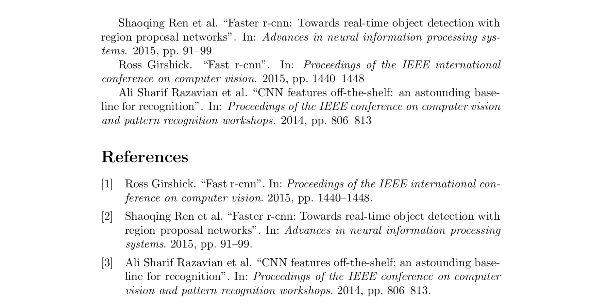
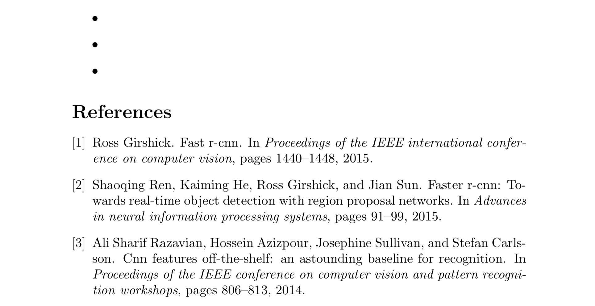
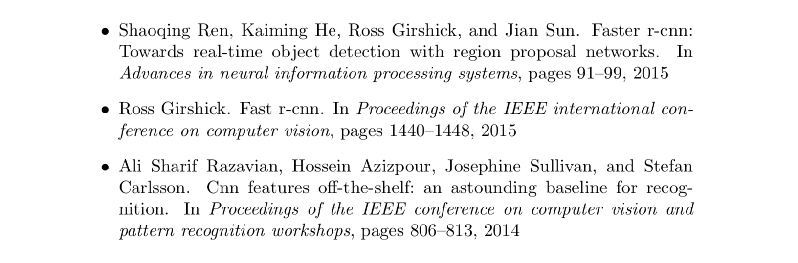
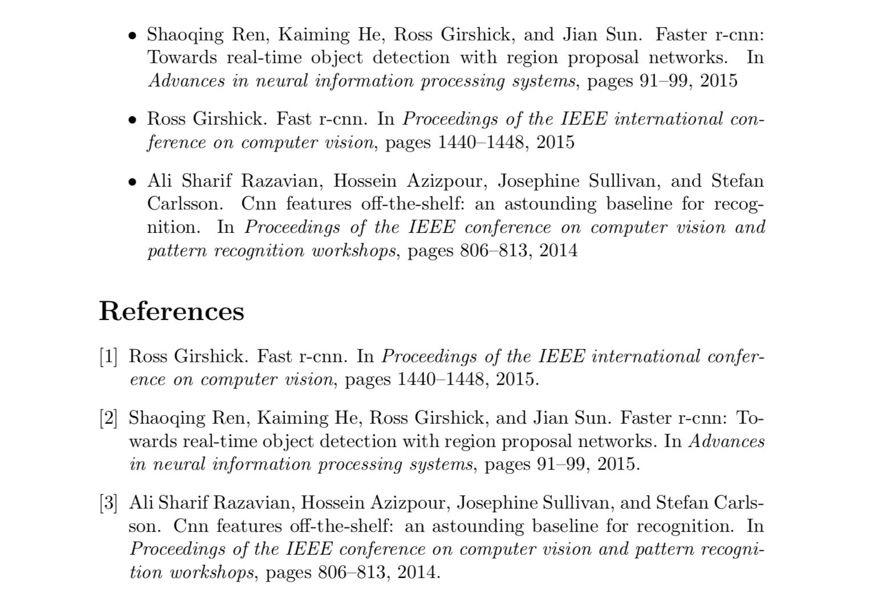
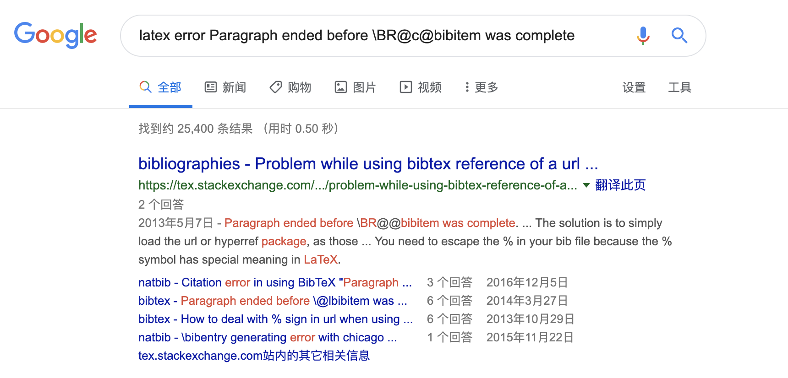
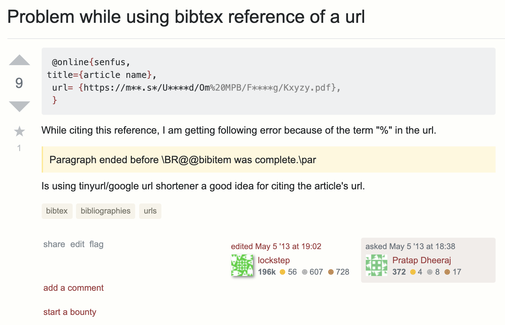
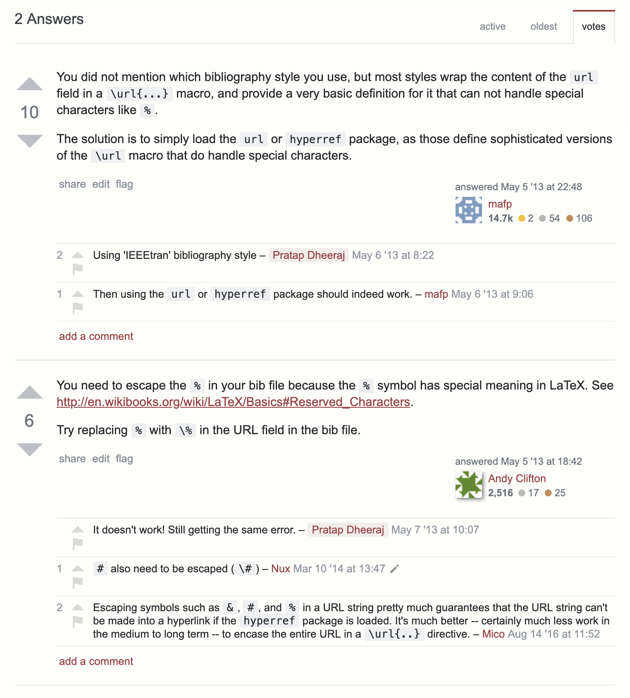
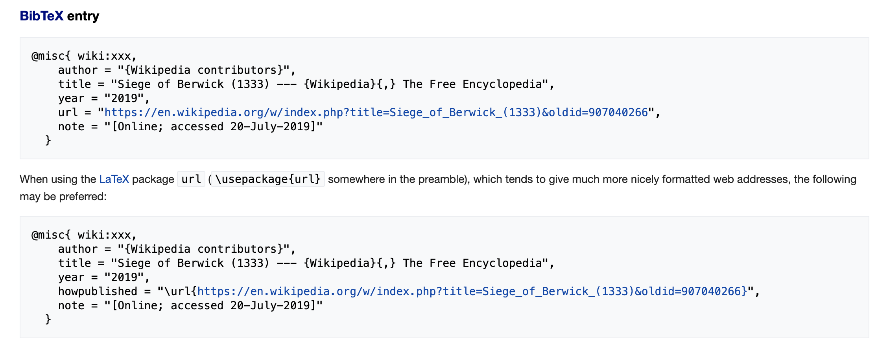
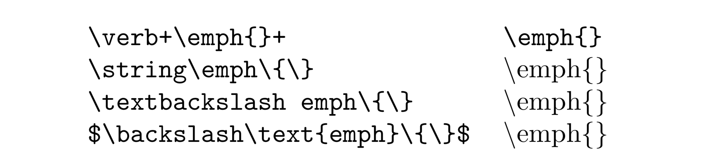

> 原文链接：[\LaTeX 的罪与罚 - 朴素的贝叶斯的文章 - 知乎](https://zhuanlan.zhihu.com/p/52006922)

作为 \LaTeX 开发者，看到这种嘲讽自然是非常 angry 的。本来并不想趟这个混水，然而眼见着赞数一天天涨上去，还居然进了精华区，实在忍不住只好注册了贵乎来说几句。

你们啊，要……还是要提高自己的知识水平！我也给你们着急啊，真的。[^zhihu]

[^zhihu]: 本文还发布在 [知乎专栏](https://zhuanlan.zhihu.com/p/74756647)。

## 一些问题的解释

原文章中大多数问题还是在于「姿势不正确」。不过作者并没有把完整的代码放出来，我们这里只能根据只言片语尝试构造出一些问题。当然，我没有……没任何……的意思。

### `\fullcite`

我们来构造一个代码示例：

```latex
% mytest.tex
\documentclass{article}
\usepackage{biblatex}
\addbibresource{ref.bib}

\begin{document}

\fullcite{ren2015faster}

\fullcite{girshick2015fast}

\fullcite{sharif2014cnn}

\printbibliography

\end{document}
```

其中的 `ref.bib` 如下：

```
Google Scholar 搜索 cnn 的前三项结果

@inproceedings{ren2015faster,
  title={Faster r-cnn: Towards real-time object detection with region proposal networks},
  author={Ren, Shaoqing and He, Kaiming and Girshick, Ross and Sun, Jian},
  booktitle={Advances in neural information processing systems},
  pages={91--99},
  year={2015}
}

@inproceedings{girshick2015fast,
  title={Fast r-cnn},
  author={Girshick, Ross},
  booktitle={Proceedings of the IEEE international conference on computer vision},
  pages={1440--1448},
  year={2015}
}

@inproceedings{sharif2014cnn,
  title={CNN features off-the-shelf: an astounding baseline for recognition},
  author={Sharif Razavian, Ali and Azizpour, Hossein and Sullivan, Josephine and Carlsson, Stefan},
  booktitle={Proceedings of the IEEE conference on computer vision and pattern recognition workshops},
  pages={806--813},
  year={2014}
}
```

原作者是在 Windows 上面用 WinEdt 自带的 PDFTeXify 编译的。手边没有 WinEdt，那就模拟一下结果。首先开命令行用 `pdflatex mytest` 编译一下：

```
LaTeX Warning: Citation 'ren2015faster' on page 1 undefined on input line 7.


LaTeX Warning: Citation 'girshick2015fast' on page 1 undefined on input line 9.


LaTeX Warning: Citation 'sharif2014cnn' on page 1 undefined on input line 11.


LaTeX Warning: Empty bibliography on input line 13.

[1{/usr/local/texlive/2019/texmf-var/fonts/map/pdftex/updmap/pdftex.map}]
(./mytest.aux)

LaTeX Warning: There were undefined references.
```

{:.invert}

出了一堆 undefined citation 的警告，PDF 里面引用又全都显示不出来，so，满意了吧？不过**请把提示信息读完**：

```
Package biblatex Warning: Please (re)run Biber on the file:
(biblatex)                mytest
(biblatex)                and rerun LaTeX afterwards.

 )</usr/local/texlive/2019/texmf-dist/fonts/type1/public/amsfonts/cm/cmbx10.pfb
></usr/local/texlive/2019/texmf-dist/fonts/type1/public/amsfonts/cm/cmr10.pfb>
Output written on mytest.pdf (1 page, 20359 bytes).
Transcript written on mytest.log.
```

所以，你还需要再跑一下：

```bash
biber mytest
pdflatex mytest
pdflatex mytest
```

现在 PDF 里面该有的就都应该有了：

{:.invert}

**含有参考文献的时候 \LaTeX 要编译多次**，这个应当属于常识。编译的消息窗口很有用的，要做什么它明明都说了，不看怪谁呢。

PDFTeXify 那一类自动编译脚本有的时候没那么靠谱，请切到命令行模式手动编译。不过大概率你可能还是直接点了 WinEdt 的编译按钮。在不清楚按钮背后究竟有什么东西的时候就直接用，这个嘛，请不要受某些国产软件「一键 xxx」的影响。

PS：我觉得 latexmk 就很靠谱，不知道为什么 PDFTeXify 不够 robust？

### `\bibentry`

作者表示 `\fullcite` 方案失败，于是换了 `\bibentry`。其实这时已经陷入了危险的境地：上面那个方案是基于 `biblatex`/biber 的，现在又换到了 \BibTeX，这两种方案并不能混用。Anyway 先假定知道这一点，再构造一个例子：

```latex
\documentclass{article}
\usepackage{bibentry}
\bibliographystyle{plain}

\begin{document}

\begin{itemize}
  \item \bibentry{ren2015faster}
  \item \bibentry{girshick2015fast}
  \item \bibentry{sharif2014cnn}
\end{itemize}

\bibliography{ref.bib}

\end{document}
```

然后编译（图省事直接用 `latexmk -pdf mytest`）：

{:.invert}

嗯，是只有 `itemize` 的几个点。

于是搜文档，果然是 `NULL`。找了一圈真没发现文档，这个应该确实是个 bug。不妨考虑去买张彩票。下面是手动生成文档的方法，不想看可以跳过。

<div markdown="1" class="small">

CTAN 页面中显示 `bibentry` 属于 `natbib` 的一部分，然而打开 `natbib` 的 `doc` 目录只有如下这些：

- `README.1st`
- `README.v831b`
- `natbib.ltx`
- `natbib.pdf`
- `natnotes.pdf`
- `natnotes.tex`

文档里面搜索也没有发现 `bibentry` 相关说明。所以看起来要么就真的没有文档（现在 CTAN 不接收不带文档的包），要么就是作者忘了。打开 `source` 目录：

- `bibentry.dtx`
- `bibentry.ins`
- `natbib.dtx`
- `natbib.ins`

编译 `bibentry.dtx` 可以得到文档。

</div>

其实 Google 搜索一下也可以找到文档，不过这不重要。一种正确的写法是用 `\nobibliography` 代替 `\bibliography`（并且要放在 `\bibentry` 前面）：

{:.invert}

另一种是作者提到的「额外写一句 `\nobibliography*`」：

{:.invert}

注意这两种结果并不一样，前者是把原来的 `thebibliography`（即参考文献表）隐藏起来，然后用 `\bibentry` 给出其中的条目；后者则允许插入原来的 `thebibliography`。至于为什么要这么麻烦，<small>这个包的原理是重定义 `thebibliography` 里面的 `\bibitem`，然后存储到一些宏里面。而 `thebibliography` 存储在外部文件 `<jobname>.bbl`，那就只有预先把它读进来，而且还不能破坏和原来参考文献机制的兼容性，</small>简单、现代的方法就在上面（`biblatex`），但你自己选择弃疗了……

### ! LaTeX Error: Missing `\begin{document}`

> begin document 就在这 \LaTeX 你瞎么 不会报错能闭嘴么 能不瞎 bb 么

这是个相当经典的问题，但却不太容易搜索到靠谱的解决方案。真的忘记写 `\begin{document}`，或者编译错了文件，确实也会报这个 error；但绝大多数时候，明明这行代码就白纸黑字写在那儿却还是「Missing `\begin{document}`」。原因在于，\LaTeX 不允许在导言区出现任何排版语句（shipout），只有宏包调用、宏定义、选项设置等才允许出现，所以不小心多输入了一个字母，就会报错：

```latex
\documentclass{article}
A
\begin{document}
\end{document}
```

另外，`.aux` 辅助文件也是在导言区（隐式）载入的，所以如果辅助文件由于不可知的原因（上一次编译失败、异常读写、高能宇宙射线等）挂了，其中的某些命令在重复编译时就会被错误执行，然后产生排版语句（即使是空的分段也算！），就出现了这个报错。经验之谈：**出现奇怪的问题，先删干净辅助文件再编译一次**。

最后，某些不可见字符，如 BOM（U+FEFF，Byte order mark）、LRM（U+200E，Left-to-right mark）等也会造成这个问题，而且不幸的是肉眼还看不出来。解决的办法是复制问题代码到靠谱的程序（推荐 [Unicode code converter](https://r12a.github.io/app-conversion/)）检查是否有可疑的字符。多说一句，\LaTeX 在 2018 年 4 月之后将 UTF-8 设为了默认编码[^utf8]，文件开始的 BOM 将不再引发问题。所以建议更新 \TeX Live 到最新版。

[^utf8]: 参考 [\LaTeXe News Issue 28](https://www.latex-project.org/news/latex2e-news/ltnews28.pdf)。

### 参考文献中的 URL

> ```
> Runaway argument?
> \BIBentryALTinterwordspacing W.~Commons, ``File hyperspectralcubejpg \ETC.
> ! Paragraph ended before \BR@c@bibitem was complete.
> <to be read again>
>                    \par
> ```
>
> inter word spacing 是说我单词中间的空格有问题呗，懂英语的人，话还是会说的吧？

显然原作者并不曾了解过怎么读报错信息。只要稍微静下心来看一遍，就可以看出来：

- 第一行是 error 的类型，这里是「runaway argument」，即「参数失控」
- 第二行给出了 error 发生的上下文，这里 `\BIBentryALTinterwordspacing` 只是一个命令，其实与 error 本身是无关的，只是不巧出现在了不该出现的地方，因而被误认为是 error
- 第三行说明了 error 的原因，这里是说段落在命令 `\BR@c@bibitem` 完成之前段就结束了

<small>
具体到这个问题，原因大致是，\TeX 里面定义宏时，默认不允许吃进去的参数（实参）里面带有 `\par`，除非手动添加 `\long` 声明，这个可以理解为一种简单的预防措施。在 \TeX 发明的上古时期，计算机性能极端受限。一旦出现异常，但由于参数中不允许出现 `\par`，\TeX 便会在下一个段落之前停下；否则这个参数可能会一直吃到文件结束，这时候机器可能就挂了。明知不能分段而偏要分段，\BibTeX 自然不会犯这种低级错误。所以，问题就是参数本身出现了意外。这里其实是因为 URL 中的 `%` 被当作注释处理，因为之后的 `}` 就无法匹配，使得参数一直吃到下一处分段而引发这个错误。
</small>

作为「\LaTeX 普通用户」，你当然可以不需要知道这些。但你会上网吧？请找一个**靠谱的搜索引擎**，然后把这个错误输进那个搜索框里面去（上下文就不用带了，这不是给人看）：



点击第一条结果（没搜到这个结果？所以上面我要强调**靠谱**二字），就是 TeX.StackExchange 上的[这个问题](https://tex.stackexchange.com/q/112637/)：



是不是一样的报错信息？（忽略上下文）

是不是一样写了网址？

是不是网址里面一样有个 `%`？



回答只有那么几句话，核心就是用 `url` 或者 `hyperref` 包，或者手动把 `%` 替换成 `\%`，这个真的很困难吗？

问题并不在于 \TeX 给的报错信息有多么晦涩难懂和反人类，而是在于，你真的有过稍微仔细地看一眼这几行报错信息的努力吗？

接下来原文作者试图解决词间空格的问题，希望你现在能够知道，这些努力就是徒劳的，因为由于你的断章取义从一开始就走入了歧途。

> 我尝试了如下方法：
>
> ……
>
> 都失败了。网上查询无果，自己翻看 PDF 文档，在其中花费了半个多小时努力寻找，眼睛都要瞎了，最终发现 `misc` 不支持 `url` 字段！！！那为什么不提示「不支持 `url` 字段」？而且凭什么故意不支持 `url` 字段？一个叫做「杂七杂八」的信息模版，就是为了容纳杂七杂八的信息的，连一个互联网来源链接都无法支持，何等的丢人现眼。

作者翻看了文档，这很好，值得表扬。随后他得出了结论：「`misc` 不支持 `url` 字段」，并且声泪俱下地把它批判了一番。

然而如果找对了文档，并且真的看了，那么，请看 [`btxdoc.pdf`](https://mirrors.ctan.org/biblio/bibtex/base/btxdoc.pdf) 的第 3.1 节 Entry Types，在第 8 页从上面数第 2 自然段：

> **ignored**&emsp;The field is ignored. BibTeX ignores any field that is not required or optional, so you can include any fields you want in a bib file entry…

后面的 `misc` 中确实没有把 `url` 作为 required 或者 optional，那么就应该被理解为 ignored，换句话说写不写都没有任何影响。事实上，这篇文档中根本就没有出现 URL 这个词，因为那个时候 URL 还就没有出现……

至于为什么 URL 还会导致 error，那显然是由于作者用了其他的参考文献样式，不管怎么样，**使用任何东西之前请阅读相应的文档**。而且顺带一提，作者之前所使用的 `biblatex` 里面，`url` 是作为 `misc` 的 optional 字段。（`biblatex` 辣么好用你换掉他作甚？）

> 要想在 `misc` 中加 `url`，要这么写：
>
> ```
> @misc{crappyLaTeX,
> howpublished = {\url{xsdfsaefaef}}}
> ```
>
> 三重括号，最为致命。那么喜欢搞异构的 struct，建议 \LaTeX 干脆把 abs，article，inproceeding 全都搞成不一样的好了，你们满意了，我们用户也干脆别用了。
>
> 噢我差点忘了，这个 bibitem 不是我自己手敲的，是从 wiki 上引用下来的，人家 wiki 自动生成的格式，bibtex 处理不了，是 wiki 所有的格式都错了呢，还是 bibtex 有病呢？

括号要匹配，难道不是理所当然的吗？还是觉得三重括号很多？（欢迎了解 Lisp）以及，无论是 `misc` 还是 `article` 还是什么，它们插入 URL 的方法都是一样的：

- 直接 `url = xxx`，然后交由给定的参考文献样式自动添加 `\url`
- 或者手动写 `howpublished = {\url{xxx}}`

至于 wiki，



已经写成这样了再（装作）看不懂我们也没有办法。

### 宏包冲突

接下来又遇到了一个问题：

> ```
> pdfTeX warning (ext4): destination with the same identifier (name{cite.mls2018_
> pub}) has been already used, duplicate ignored
> <to be read again>
> \relax
> l.432 \bibitem{mls2018_pub}
> ```

实际上这边是两个问题，却被原作者混为了一谈。Identifier duplicate 的问题其实只是个 warning，而且是在这里是完全可以忽略的。后面的确是一个 error 的样子，但作者没有给出完整信息，表示无能为力。

作者凭着探索热情继续查找，发现根源是 `bibentry` 与 `hyperref` 的冲突。同时，它还列出了一大串会冲突的宏包，仿佛食物的相生相克。

宏包冲突本是个很正常而且不可避免的问题。归根结底，是因为同样的命令只能定义一次。后面的定义要么是覆盖原来的，要么就是报错。有人要问，那 Python、JS 什么的那么多库不也可以和平共处吗？请问 Python 里面是怎么 `import` 的，`import` 进来的库是不是还得加一个前缀？不加前缀你知不知道别人的模块里面会不会加进奇怪的东西？

\LaTeX 的机制决定了某些接口只有唯一的写法。`\section` 就必须叫 `\section`，否则所有的文档就要全部改写。刚有 \LaTeX 的时候，PDF 还不知在哪儿；后来人们看 PDF 是好的，又希望可以支持 fancy 一点的功能，比如超链接、书签这种。So，惟一的办法就是 redefine `\section` 这些命令。那你怎么能保证别人不会先改了这个命令，让你无处可改？一句话，没有办法，只有认了。（要不试一试写 `\hyp@section` 这样的东西出来？）

这里列的表可以简单说明一下，以防不明真相的吃瓜群众被吓到。

> - Hyperref 和 preamble pages 冲突
> - Hyperref 和 Fancy headers 冲突
> - Hyperref and Algorithm 冲突
> - Hyperref and Algorithmic 冲突

`hyperref` 是冲突大户，这个也应当属于常识。除非特殊说明的，比如 `cleveref`、`algorithm` 一类，其他时候都应该保证 **`hyperref` 在最后调用**。

> - Algorithms and Pseudocode 冲突

废话，两个包干的是差不多的活，接口又差不多，没事为什么要两个一起用？同类的还有 `biblatex` 和其他基于 \BibTeX 的包，底层机制都不一样不冲突那可见鬼了。

> - PGF 和 double subscripts 冲突

没事请不要把[十二年前就修好的 bug](https://github.com/pgf-tikz/pgf/blob/f5d0ffd6e4a553d40855370c692fea6e33a0026d/doc/generic/pgf/ChangeLog#L4153) 拉出来……

> - XeLaTeX 和 pdftex driver 冲突
> - XltXtra and Graphicx 冲突
> - Amssymb with Xunicode 冲突

很多包是为 8-bit 的引擎写的，后来有了 \XeTeX、\LuaTeX 这些东西就通通可以规避掉了。以及，没有必要画蛇添足，`graphicx` 包加上 `[xetex]` 这样的选项纯粹是多余的[^graphicx-option]。**只要涉及 ASCII 之外的东西，请一律使用 \XeTeX 或者 \LuaTeX 编译。**

[^graphicx-option]: 传统上 \TeX 的流程是先生成 `dvi`，再接后续操作（即「驱动」，如 `dvips`、`dvipdf`、`dvipdfm`、`dvipdfmx` 等）。插图、彩色支持是在第二步做的，\TeX 并不知道具体细节，所以需要手动给 `graphicx` 加上选项以指定驱动使其能够写入特定代码（`\special` 命令）。但现在主流都是 \pdfTeX、\XeTeX、\LuaTeX 等「一步到位」的东西，宏包可以自动判断，不需要也不建议手动指定。

> - Caption 和 Subfig 冲突

`subfig` 包已经调用过了 `caption`，再调一遍还用不同的选项那只有报错了。很多现代的宏包都提供了 `\xxxsetup{<key>=<value>}` 的写法，这样可以很好地规避宏包选项的冲突。

PS：这段话中英文夹杂、大小写错乱怎么看怎么别扭。国内的博客大多是东抄西抄，这个宏包冲突的介绍不知道转了几遍：

- <http://blog.sina.com.cn/s/blog_5e16f1770100ju9l.html>
- <https://www.latexstudio.net/archives/7915.html>
- <http://www.macfreek.nl/memory/LaTeX_package_conflicts>

求求你们花几分钟找一下原始资料吧！

### 中文字体支持

> Pull 下来一编译，您猜怎么着！噢我的老天爷，放到 mac 上编译不好使了哈哈哈！一个跨平台的软件，入了乡还不能随俗的呀。
>
> ``TeX fontset `mac' is unavailable`` 是什么鬼？老子行走江湖从未见过这种错误。
>
> 查来查去，很多人都说改一改字体，用 mac 支持的字体就好了，我前前后后改了数十个字体，挨个去 macOS 的 Font 管理器里对照，都有啊，有这个字体啊。

字体，尤其是中文字体的跨平台方案，在过去一直是个老大难问题。然而朋友，现在 2019 年都已经过去一半了，你的知识还在上一个十年，我们能有什么办法呢？

**所有包含汉字的文档，请一律使用 \XeLaTeX 编译，配合 `ctex` 文档类/宏包**，可以保证不出问题。非要用 \pdfLaTeX，就怪不得别人了。（不知道 \XeLaTeX？那你可能学了假的 \LaTeX）

> 后来我干脆从我自己的 Windows 10 上下载了所有的字体
>
> 我把 windows 10 里的整个字体文件夹压缩好了，安装在 mac 上。
>
> 老子现在有五百多个字体，能绕地球一圈，连微软雅黑我都有，重构字体缓存吧！字体放到 `texmf` 什么鬼的文件夹去吧！重构 \LaTeX 字体缓存吧！编译吧 latex 君！
>
> 还是这个错误。

`ctex` 默认配置在 macOS 上不需要微软雅黑，字体缓存也不需要重建（macOS 上的 \XeTeX 不用 fontconfig 库），更不需要「放到 `texmf` 什么鬼的文件夹去」。提供教程的家伙需要向全国人民谢罪。

> 经过三天的调试，我改用了 \XeLaTeX，删除了所有字体的自定义，全都 tm 默认吧，然后居然能编译了？？？

使用默认配置进行测试应该是第一分钟就做的事情，感觉这三天是白白耽搁了。表示同情。

> 我这正文都是宋体，该强调也强调了，怎么？哎！
>
> 这是为什么啊，怎么宋体里面多了楷体？？？我原文怎么写的？
>
> 这就是一个强调啊？怎么不给斜体，不给粗体，给了个奇奇怪怪的楷体

**中文从来没有斜体**，使用楷体来对应西文中意大利体的做法，是一种常规操作[^han-italic]。不给斜体和（伪）粗体，是对你的排版质量负起最低限度的责任。

[^han-italic]: 刘育黎. [楷书、斜体、连笔，意大利体的汉字匹配方案探索](https://mp.weixin.qq.com/s/gd2rB0hjZhPGavGcZKtSOg)

> 字体字号还和正文不匹配

请区分「字号」与「字面」（这确实是一个问题，然而我敢打赌这个词你都没听过）。

> 也没像英文一样给我多加半个空格隔开

中文从来不需要使用空格分词，何况，写英文你会手动加上空格的吧？

### 抄录环境

作者为了显示 `\emph{}`，先后尝试了如下方案：

- `\emph\{\}`
- `\\emph\{\}`
- `$\\\text{emph}\{\}$`
- `$\backslash$...`

最后一条还是「六年 \LaTeX 专家」出手的结果，然而还是没有搞出来，这「专家」真的不够给力诶。

记住了！这个叫**抄录环境**（verbatim），行内的直接写 `\verb<char>...<char>`，这边 `<char>` 随意但前后要一致，里面随便怎么写。所以，你要的东西就是 `\verb+\emph{}+`。

`\\` 是换行，表格里面的那种换行。既不是分段，也不是什么转义（\TeX 里面只是额外定义了一些命令来表示这些特殊符号，和其他语言里面加反斜杠转义是有本质不同的）。而第三种、第四种写法属于蓄意滥用数学环境，请不要这么做。

下面列了几个「可以满足要求」的方法，你选择哪个？（`\verb` 会默认使用等宽字体，其余默认正文字体）

{:.invert}

PS：原文图里面 `\TeX` 后面漏了 `{}` 或者 `\<space>`，而且引号写反了……

### 辅助文件

> 让我们来找个答辩模板编译一个 PPT 吧，就从上一届毕业生那里拿一个好使的来好了。
>
> 曾经亲眼目睹编译成功的我，这次又栽在了起跑线上：

编译之前删掉原来的辅助文件，这是常识。**把别人的东西拿过来直接跑基本不可能成功**，这也是常识（误）。

> 没有问题创造问题也要上，不然怎么点亮 github 的贡献方格呢。

我们刷绿方块都是靠改 typo 的（大误）。

> 「握日，怎么生出这么多不认识的文件？？？比 Visual Studio 还多！文件夹都快填满了！」
>
> ……通情达理的我知道每个文件背后，都有一个辛勤的开发者，花费无数个日日夜夜为这个格式的临时文件设计语法、宏、变量、函数、数据格式……。每一个临时文件都像一个秘密的宝藏等待着我去挖掘。我想到只要把这些中间文件都弄懂，我就是半个专家了。
>
> 我已经迫不及待了，快让我看看有多少种中间文件需要学习呀！
>
> 彼之宝藏，我之垃圾。

辅助文件无非这么几类：

- 第一遍生成之后，第二遍再读进去，以生成交叉引用、参考文献、目录、索引等（可能需要外部程序参与），比如 `*.aux`、`*.bbl`、`*.toc`、`*.idx`、`*.ind` 等
- 日志，如 `*.log`、`*.blg` 等
- 目标文件的中间产物，如  `*.dvi`、`*.xdv` 等
- SyncTeX 相关，用于 PDF 与源文件之间的跳转，如 `*.synctex`、`*.synctex.gz` 等

宏包那么多，为了避免冲突，当然是生成不同的文件最简单了。`.gitignore` 里面写的，一大半保证你不会遇到。反过来，遇到的 edge case 也未必能完全覆盖，所以用之前最好自己 check 一下。

关于中间文件的语法，如果是被 \TeX 读进去的，那自然还是 \TeX 的语法，并不会很诡异；日志都是纯文本，识字就能看懂。反正编译中间没必要管，编译完了放心大胆地删。编辑器一般都会有配套的工具，自己写个脚本也应该没什么困难。

## 一些感悟

> 这是我使用 \LaTeX 的第三年，踩了很多坑后，我也开始有了对 \LaTeX 的一些感悟。

不巧，这也是我使用 \LaTeX 的第三年（从我 2015 年年底装 \CTeX 套装开始算，四年不到），所以我也有「对 \LaTeX 的一些感悟」。

### 入门之前

> 在拥挤的办公桌前，面对 `doc` 文件夹下三千多个 PDF readme，我知道我这辈子都没办法做一个 \LaTeX 科班生。然而，命运不会等人，我手中小小的报告，常常 24h 内就必须要飞到老师的邮箱中。

比较不幸的是，大多数人用 \LaTeX 都是被迫 / 半被迫的：你的老板可能并不会管你会不会用就直接把你逼上梁山，建模比赛别人都用我不用就没奖了（误）。但没有什么办法，**24h 内掌握 \LaTeX 就是不现实**，至少得匀出几个礼拜到几个月的时间才能上手。既然知道「老板可能要我用一个之前没碰过的工具」，是不是应该提前预留一些学习时间呢？

> 我也希望自己能做一个弄明白 \LaTeX 的人。然而可惜的是，我或许永远无法将 \LaTeX 看作一个「专业工具」，拿出钻研编译原理的劲儿来啃透 \LaTeX。
>
> 这或许是因为，在座的你我需要的无非是排个章节、插个图、上下标、来几行公式……我们需要一个能好好地把字母排列到理想位置的「效率软件」，而不是一个慢吞吞又挑三拣四难以融洽的「活祖宗」。

这是很多人的困扰：我就是只要写个文章为什么要把 \LaTeX 搞得这么清楚？此时可以类比如下问题：

- 我只是写个 C 的 Hello world，怎么还要学命令行、学 Linux、学 Makefile、学 Git……？
- 我只是学计算机、学数学、学 xxx，为什么要会英语？
- 我一个理科生为什么要学语文？我一个文科生为什么要学数学？买菜又不用三角函数微积分解析几何……

具体问题具体来说。不管你认不认可，\\(La)TeX 就是一个完备的编程语言，虽然你需要的可能只是「作为标记语言」的那一个子集。所以，准备上手之前，**请务必认清楚自己的身份**：

1. 我要按照模版写毕业论文、建模论文、期刊论文

   你需要找一些合适的入门材料，学习基本的语法。有模版**请严格按照模版的说明操作**，不要根据自己的喜好做任何修改（你的感觉与偏好在这个阶段极有可能是有问题的）。重点请放在文章的内容，而不是文章的格式。出现任何问题请找模版作者，没有必要试图自己解决。

2. 我要记笔记、出试卷、写书

   同上，请先从入门开始。熟悉基本流程之后再放飞自我，刘海洋的《\LaTeX 入门》可以备在手边随时翻阅。每天读两次《入门》，每次都有新收获。

3. 我要系统学习排版知识，写模版、写宏包

   你可能确实要拿出「钻研编译原理的劲儿」。排版的水可能比你想象的还深，而 \TeX 跟主流编程语言大相径庭也需要一些时间来掌握。Google、GitHub 和 StackExchange 将会是你的好朋友，以及，英语是必须的。

4. 我要写世界上最好的排版引擎干掉 \TeX

   请联系 @李阿玲。（逃

5. 老板让我干什么我就干什么

   祝好运，不送。

### 入门教程

知乎上老生常谈的问题，前辈们的回答可以认真读：

- [如何在 1 小时内快速入手 \LaTeX？ - 刘海洋的回答](https://www.zhihu.com/question/268569440/answer/339239086)
- [如何从零开始，入门 \LaTeX？ - 孟晨的回答](https://www.zhihu.com/question/62943097/answer/203670095)
- 自学 \LaTeX 可以读什么书入门？ - [刘海洋的回答](https://www.zhihu.com/question/26645810/answer/33515971)、[孟晨的回答](https://www.zhihu.com/question/26645810/answer/33529115)

当然也可以选择看下面的：

刚入门的头几步将会在很大程度上决定之后的路好不好走。不论是看了谭浩强的 C 语言，还是不知道从哪里找来的 \LaTeX 教程，后果都是出现一堆稀奇古怪的问题，自己还找不到解决方法。所以，我们非常希望新手能够选择一些**靠谱、合适**的入门教材。

现在（2019 年 7 月），我们只推荐下面这些材料：

- 一份（不太）简短的 \LaTeXe 介绍（lshort） [[PDF]](https://mirrors.ctan.org/info/lshort/chinese/lshort-zh-cn.pdf) [[GitHub]](https://github.com/CTeX-org/lshort-zh-cn)
- 一份简短的安装 \LaTeX 的介绍 [[GitHub]](https://github.com/OsbertWang/install-latex-guide-zh-cn)
- 刘海洋的《\LaTeX 入门》（跳过 \CTeX 套装的部分）

lshort 强烈建议**完整**读一遍，普通文章排版所需要的几乎全部功能这里都包含了。找不到直接去《\LaTeX 入门》的相关章节翻阅（当字典查）。其他网上的资料，wikibook 上的教程可以参考，知乎请认准那几位的回答，b 站鱼龙混杂谨慎使用，而 csdn、科学网博客、x 度文库请**绝对不要看**。

有人带自然很好，但请先判断他的水平。最简单的依据：如果他还在用 \CTeX 套装，或 WinEdt 7.0 及以下，或代码里面出现了 `CJK` 环境，那么请立刻远离（当然，仅限 \LaTeX 方面）。

发行版建议使用最新版 \TeX Live（目前是 2019），或者在线使用 [Overleaf](https://www.overleaf.com/)（最好自备梯子）。**\CTeX 套装绝对不要用**。

最后一点提醒：如果你不小心学了假的 \LaTeX，建议回头重读一遍以上列出的入门材料。

### 如何找模版

> 为了写出符合学校要求的论文，谁都需要一个好用的模版，而不出意外地，我也是其中的一员。
>
> - 实验室的算法大神世豪搞了个模板用，折腾折腾，一编译，好使！
> - 我拿来用，不好使，浪费了一两天时间。
> - 实验室编码大神益达用了个模板，折腾折腾，编译一下，好使！
> - 我换成他的，不好使，浪费了一两天时间。
> - 我上 Github 下载了一个的 ZJUthesis
> - 不好使，浪费了两三天吧。
> - 换成另一个 github 上的 zju 模板，不好使。
> - 这时候数学优化大神萝卜给我了一个师兄自用的模板。
> - 我试了一下午，不好使。

怀疑你在黑 zju 然而我找不到证据……

首先，**学长 / 学姐 / 大神 / 巨佬拷给你的模版几乎一定是不好用的**。目前大多数高校的模版都挂在了 GitHub 上面，有些还发布在了 Overleaf 或者 CTAN 上面，请认准这些（半）官方渠道。（请问你会选择 `pip`、Anaconda，还是湿兄拷给你的 TensorFlow ？）

其次，GitHub 上面找模版，居然还去试了几个。没有经验可以告诉你一点经验：

- 没有 README、LICENSE、`.gitignore` 的可以直接忽略（原文章居然吐槽了 LICENSE 这我还能说什么？）
- Commit 很少，几个月内又没有什么更新，建议不要用
- Issue 越多说明积累的问题越多，也就意味着用户越多，当然前提是作者要去处理 issue
- Star、fork、watch 都很少的话请小心使用，不过也有可能是比较新的缘故
- 使用 `dtx` 作为源代码、有测试文件、用 ci 的模版往往更靠谱一些

最后，下载下来觉得不好使。请问有看过模版的使用说明吗？有完全按照模版提供的编译说明来跑吗？这样再出现问题应该直接联系模版作者 or 跑去 GitHub 提 issue。一个靠谱的模版作者应当可以解决你的问题。

### Debug 策略与提问的姿势

> 生活总是充满苦涩，我选择了一个 error 最少的 `cls` 文件，从 0 开始，一点一点把各个模板好使的语句慢慢粘贴过来，形成一个巨大的 `tex` 文件。

原文作者显然完全没有 debug 的能力。首先要做的是分解问题，而不是把所有东西全部堆过来来碰运气，这样只能变成一座 [shit mountain](https://www.zhihu.com/question/272065178)。

我们这里可以通过一个例子说明：[ctex-kit #331](https://github.com/CTeX-org/ctex-kit/issues/331)

原来的问题简单得很：

```latex
\documentclass{ctexart}
\usepackage{fancyvrb}
\begin{document}
\begin{Verbatim}
'鸢尾花'
\end{Verbatim}
\end{document}
```

可以看到左边的引号后面多出了一个空格：

{:.invert}

然而，该用户因为知道「`zhspacing` 包是用来解决中英文之间的空格，包括代码块中中英文之间的空格」，所以想用 `zhspacing` 包来处理，结果却遇到了 Linux 下没有 SimSun 字体而产生的错误，这才过来报告 issue。

该用户发现在 Windows 上配合 `zhspacing` 包可以实现想要的效果：

{:.invert}

观察仔细可以发现这里的引号其实是蝌蚪引号 U+2018 Right single quotation mark，而不是编程语言中一般用的 U+0027 Apostrophe。所以这其实并不是正确的解决方案。

暂且不讨论引号的问题。所谓的「穷折腾」从一开始就完全带偏了节奏，也在一定程度上招致了开发者的不满。我们可以看到，该用户自始至终就没有提供一份足以展示问题的代码，而只有代码本身才是解决问题的钥匙。

接下来，@yihui 提供了代码（第一份代码只是引号的正常宽度，与本问题无关），那么问题就好解决多了：

```latex
\documentclass[UTF8]{ctexart}
\usepackage{color}
\usepackage{fancyvrb}
\newcommand{\VerbBar}{|}
\newcommand{\VERB}{\Verb[commandchars=\\\{\}]}
\DefineVerbatimEnvironment{Highlighting}{Verbatim}{commandchars=\\\{\}}
\usepackage{framed}
\definecolor{shadecolor}{RGB}{248,248,248}
\newenvironment{Shaded}{\begin{snugshade}}{\end{snugshade}}
\newcommand{\StringTok}[1]{\textcolor[rgb]{0.31,0.60,0.02}{#1}}

\begin{document}

\begin{Shaded}
\begin{Highlighting}[]
\StringTok{"鸢尾花"}
\end{Highlighting}
\end{Shaded}

\end{document}
```

这个代码已经足够简短，并且也展示了问题。当然还可以继续简化：

- 颜色有关的代码可以通通删去
- 定义的 `\VerbBar` 等命令没用到，删掉
- `Highlighting` 用 `fancyvrb` 宏包自带的 `Verbatim` 代替

这样我们就得到了一开始的那份问题代码，于是终于可以开始 debug 了。

1. 使用 \LaTeX 的标准 `verbatim` 环境（注意大小写），发现是正常的。
2. 使用 `article` + `xeCJK` 代替 `ctexart` 文档类，同样出现问题。
3. 在 `xeCJK` 的文档中搜索有关抄录环境的问题，可以找到 `Verb` 选项和 `\xeCJKVerbAddon` 等命令。根据说明，我们可以把它添加到 `fancyvrb` 宏包的 `formatcom` 选项中：

   ```latex
   \documentclass{article}
   \usepackage{xeCJK,fancyvrb}
   \DefineVerbatimEnvironment{Highlighting}{Verbatim}{%
     commandchars=\\\{\}, formatcom=\xeCJKVerbAddon}
   \begin{document}
   \begin{verbatim}
   '鸢尾花'
   \end{verbatim}
   \begin{Verbatim}
   '鸢尾花'
   \end{Verbatim}
   \begin{Highlighting}
   '鸢尾花'
   \end{Highlighting}
   \end{document}
   ```

   这时修补过的 `Highlighting` 就可以表现正常了（`Verbatim` 用来对照）：

   {:.invert}

4. 查看[代码](https://github.com/CTeX-org/ctex-kit/blob/dce0e53ef106740d74e676164a9039de27b79596/xeCJK/xeCJK.dtx#L7491-L7495)可以看出，`xeCJK` 仅为 `\verbatim@font` 打了补丁，而这个是 `\verb` 或者 `verbatim` 环境内部所使用的字体样式。如果是其他抄录环境则需额外定义（`listings` 宏包由于使用自己的一套机制 `xeCJK` 对此单独做了修补）。

到此问题便得到了解决。我们可以总结一下：

- 有问题请尽快整理出示例，向更有经验的人求助。一知半解 + 穷折腾很有可能会把问题代入死胡同。
  1. xx
  1. xx
  1. xx
  1. xx
- 一定要给出**最小工作示例（MWE）**：
  - 应当是一个**完整**的、在你的电脑上**能编译**的 \LaTeX 文档
  - 何为完整？以 `\documentclass` 开始，以 `\end{document}` 结束
  - 在你电脑上的编译结果，应当能**复现问题**，或**体现需求**
  - 与复现问题和体现需求**无关的代码应尽可能少**，如各种宏包的加载、自定义的命令等
  - 尝试更换为标准文档类（`article`、`ctexart`）等
  - 如果复现问题需要其他文件（图片、`bib` 等），请把它们和 \LaTeX 文档一起打包
- 给出 MWE 的过程就是 debug 的过程。这时需要进一步删掉无关代码，呈现问题原貌，此时可以：
  - Print 大法好！\TeX 的 `\show` 命令可以展示宏的内容，而 \LaTeX3 还提供了更多的类似函数
  - 一点点注释掉无关内容，二分法定位
  - 插断点，实际上 `\show` 的时候编译会中止，我们常利用多个 `\show` 来定位 bug

### \TeX 要面向现代化、面向世界、面向未来

众所周知，\\(La)TeX 是一个很古老的东西，很多问题归根结底都源自于历史的局限。「新一代」的引擎 \XeTeX 和 \LuaTeX 十多年前就进了 \TeX Live，阿玲姐姐的那一个也指日可待。然而却还总有人试图靠 8-bit 引擎来解决 CJK 问题，对这样固步自封的行为我们表示遗憾。

语言方面，宏语言捉襟见肘的表达能力确实是一个问题。但 \LaTeX3 也在逐渐成熟，二十多年积累下来的方方面面的经验使得它正在成为标准库一样的东西。当有了统一的框架，可以想见开发与使用都将变得更加容易。与此同时，\ConTeXt 那边也在持续地尝试新的想法，对 variable fonts 和 color fonts 的支持 2017 年就已经做了[^context]。所以，在追赶潮流的能力上 \TeX 丝毫不比那几家商业公司差多少（误）。

[^context]:

作为开发者，我们自然希望用户的使用门槛可以一降再降，遇到的坑也能够越来越少。不过，这都建立在用户自己有尝试、探索、讨论与交流的热情之上。遇到问题，只会无头苍蝇一样四处乱撞，或者阴阳怪气地嘲讽，我们只能提醒你：**恐怕使用 Word 的能力你也没有**。

`\bye`

## 引用与注释

<div id="footnotes" markdown="1">
1. {:#fn:context} 参考 TUG@BachoTeX 2017 会议上 Hans Hagen 所做的报告：
  - [Variable Fonts](https://www.tug.org/texlive/devsrc/Master/texmf-dist/doc/context/presentations/bachotex/2017/bachotex-2017-variablefonts.pdf)（`texdoc variablefonts.pdf`）
  - [Picture Fonts](https://www.tug.org/texlive/devsrc/Master/texmf-dist/doc/context/presentations/bachotex/2017/bachotex-2017-emoji.pdf)（`texdoc emoji.pdf`）
</div>
