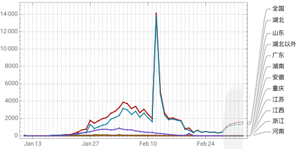
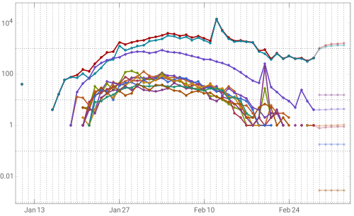
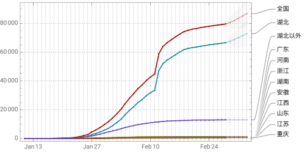
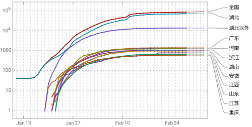
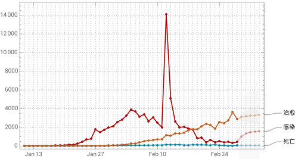
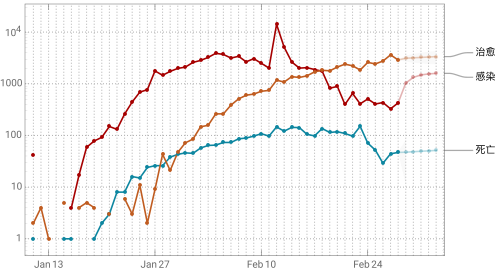
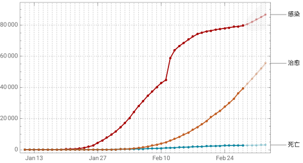
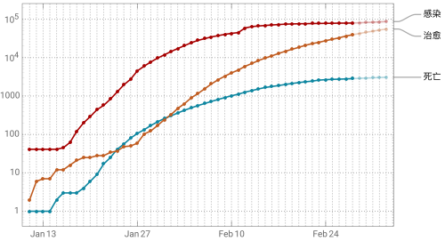
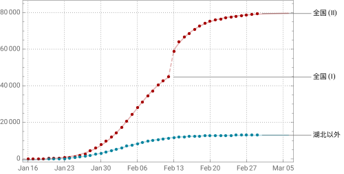
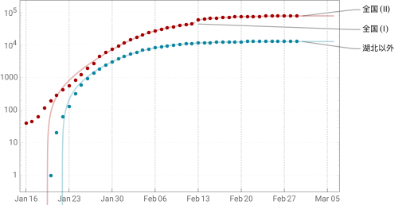

新年伊始，肺炎疫情从武汉蔓延至全国乃至世界各地，形势越发严峻。这里简要罗列一些数据，并且据此给出（未必非常靠谱）的预测。

<!-- more -->

<!-- TODO: update url -->
本文数据见 [2019-nCoV-data.csv](https://github.com/stone-zeng/stone-zeng.site/blob/main/src/posts/2020-02-01-wuhan-coronavirus/2019-nCoV-data.csv)，来源于[^2019-nCoV-wiki][^2019-nCoV-tg]。绘图及拟合代码见 [2019-nCoV.wl](https://github.com/stone-zeng/stone-zeng.site/blob/main/src/posts/2020-02-01-wuhan-coronavirus/2019-nCoV.wl)。

[^2019-nCoV-wiki]: [2019 新型冠状病毒中国大陆病例 - 维基百科](https://zh.wikipedia.org/wiki/2019新型冠状病毒中国大陆病例)。由于统计口径差异等原因，新增病例数之和与累计病例数、各省市数据之和与全国数据均略有出入。
[^2019-nCoV-tg]: [2019-nCoV 疫情实时播报](https://t.me/nCoV2019)

说明：

- 统计数据截至 **2020 年 2 月 29 日**
- 2 月 13 日，湖北省将临床诊断病例数纳入确诊病例数进行公布[^hubei-02-13]

[^hubei-02-13]: 湖北省卫生健康委员会. [2020 年 2 月 12 日湖北省新冠肺炎疫情情况](https://wjw.hubei.gov.cn/bmdt/ztzl/fkxxgzbdgrfyyq/xxfb/202002/t20200213_2025580.shtml)

## 时间序列分析

深色曲线为实际数据，浅色曲线为预测数据，阴影部分为 95% 置信区间。

<figure>
  <ImageGroup>
    
    
  </ImageGroup>
  <figcaption>新增确诊病例统计（左：线性坐标，右：对数坐标，下同）</figcaption>
</figure>

<figure>
  <ImageGroup>
    
    
  </ImageGroup>
  <figcaption>累计确诊病例统计</figcaption>
</figure>

<figure>
  <ImageGroup>
    
    
  </ImageGroup>
  <figcaption>新增感染、死亡、治愈病例统计</figcaption>
</figure>

<figure>
  <ImageGroup>
    
    
  </ImageGroup>
  <figcaption>累计感染、死亡、治愈病例统计</figcaption>
</figure>

## 回归分析

使用 Logistic 模型

$$
\hat{y} = \frac{a}{1 + b \cdot k^{\hat{x}}} + c
$$

和指数模型

$$
\hat{y} = a \, \mathrm{e}^{-k\hat{x} + b} + c
$$

对全国及湖北省以外确诊病例分别进行拟合。为获得更加准确的拟合结果，对前期数据进行了一定调整，相当于从 2020 年 1 月 15 日开始统计。考虑到临床诊断病例的影响，对全国数据进行分段拟合。

<figure>
  <ImageGroup>
    
    
  </ImageGroup>
  <figcaption>累计确诊病例拟合</figcaption>
</figure>

拟合结果及有关参数见以下表格：

|           | 拟合结果                                                     | 最终值  | *R*²     | Adj-*R*² |
|:---------:|:------------------------------------------------------------:|:-------:|:--------:|:--------:|
| 全国 (I)  | $52464.4 - \dfrac{53000.9}{1 + 0.00307582 \times 1.30876^x}$ | -       | 0.999818 | 0.999787 |
| 全国 (II) | $79884. - 89.6499 \, \mathrm{e}^{11.4149 - 0.206377 \, x}$   | 79884.  | 0.999982 | 0.999977 |
| 湖北以外  | $12958.6 - \dfrac{13757.6}{1 + 0.0126747 \times 1.25774^x}$  | 12958.6 | 0.999909 | 0.999899 |

<!-- x⁰ x¹ x² x³ x⁴ x⁵ x⁶ x⁷ x⁸ x⁹ x⁺ x⁻ x⁼ x⁽ x⁾ xⁿ -->

|           | 参数 | 估计值     | 标准误差    | *t* 统计量 | *P* 值        |
|:---------:|:----:|:----------:|:-----------:|:----------:|:-------------:|
| 全国 (I)  | *a*  | -53000.9   | 751.854     | -70.4936   | 2.45531×10⁻²⁹ |
| ^^        | *b*  | 0.00307582 | 0.000278589 | 11.0407    | 6.87192×10⁻¹¹ |
| ^^        | *c*  | 52464.4    | 679.862     | 77.1692    | 2.82508×10⁻³⁰ |
| ^^        | *k*  | 1.30876    | 0.00687273  | 190.428    | 1.12974×10⁻³⁹ |
| 全国 (II) | *a*  | -89.6499   | 0.0028307   | -31670.6   | 1.17147×10⁻⁵² |
| ^^        | *b*  | 11.4149    | 0.253772    | 44.9809    | 1.17765×10⁻¹⁵ |
| ^^        | *c*  | 79884.     | 260.342     | 306.842    | 1.76602×10⁻²⁶ |
| ^^        | *k*  | 0.206377   | 0.00881982  | 23.3993    | 5.19751×10⁻¹² |
| 湖北以外  | *a*  | -13757.6   | 87.5021     | -157.226   | 6.97436×10⁻⁵⁴ |
| ^^        | *b*  | 0.0126747  | 0.000886563 | 14.2964    | 1.20379×10⁻¹⁶ |
| ^^        | *c*  | 12958.6    | 31.0383     | 417.504    | 1.44724×10⁻⁶⁹ |
| ^^        | *k*  | 1.25774    | 0.00403817  | 311.463    | 7.37249×10⁻⁶⁵ |

## 总结

引用世界卫生组织总干事 Tedros Adhanom 的一句话：[^who-twitter]

[^who-twitter]: @WHO 的[推文](https://twitter.com/WHO/status/1222969618505093121)。

**We must remember that these are people, not numbers.**
{.text-center}

## 注释与参考

