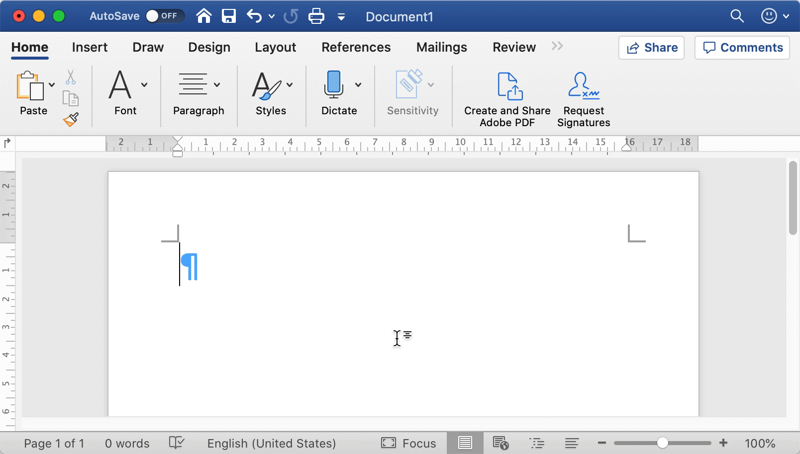

前文链接：

- [在 \LaTeX 中使用 OpenType 字体（一）](./2018-08-08-use-opentype-fonts)
- [在 \LaTeX 中使用 OpenType 字体（二）](./2019-07-06-use-opentype-fonts-ii)

以上两篇文章介绍了 \LaTeX 中使用 `fontspec` 等宏包设置字体、选择样式的基本方式。但是，在这近万字的篇幅中，我们始终都回避了数学字体的问题。排版数学公式是 \TeX 设计的初衷，也是 \LaTeX 最为人所称道的功能[^leo-liu-latex]。现代 \TeX 引擎（\XeTeX 和 \LuaTeX）在传统 \TeX 的基础上，还支持以 Unicode 和 OpenType 为基础的数学排版方案。在 \LaTeX 中，可以通过 `unicode-math` 宏包使用这些功能。

[^leo-liu-latex]: 刘海洋. 《\LaTeX 入门》

## 背景

在过去，Microsoft Office 使用 [MathType](https://en.wikipedia.org/wiki/MathType) 的某个阉割版作为自己的公式编辑器。2006 年左右，微软为了自己 Office 2007 的恢宏大业，联合各方力量，设计出了一套新的数学公式排版方案：[^office-math]

[^office-math]: Murray Sargent III. [High-Quality Editing and Display of Mathematical Text in Office 2007](https://docs.microsoft.com/archive/blogs/murrays/high-quality-editing-and-display-of-mathematical-text-in-office-2007/)

- 字符集方面，依靠 Unicode 提供大量数学符号的支持，包括[^unicode-utr25]
  - 数学用字母、数字
  - 特殊符号，如算符、箭头、几何图形等
  - 数学变体选择器
- 字体排印方面，为 OpenType 引入了 `MATH` 表，允许使用大量参数调整公式排版
- 具体的字体方面，由 Jelle Bosma 和 Ross Mills 等人设计了 [Cambria Math](https://en.wikipedia.org/wiki/Cambria_(typeface)#Cambria_Math) 作为默认数学字体
- 输入方面，使用自动替换功能可以比较方便地插入特殊符号

[^unicode-utr25]: [UTR 25: Unicode Support for Mathematics](https://www.unicode.org/reports/tr25/)

<figure>
  <!-- TODO: inline markdown -->
  
  <figcaption>Word 2019 中的公式编辑器。特殊符号可通过反斜线 <code>\</code> 转义，其后输入空格则会触发自动替换</figcaption>
</figure>

花开两朵，各表一枝。\\(La)TeX 这边虽然历经一二十年已经搞成了公式排版的事实标准，但缺乏新技术的支持（Unicode 和 OpenType 也不能算新了），很多时候仍然显得落伍。于是 Jonathan Kew 单枪匹马开发出了 \XeTeX，终于与时代接了轨。再后来 Hans Hagen 等人又开发了 \LuaTeX，与 \XeTeX 一样原生支持 Unicode 与 OpenType，同时还可借由内嵌 Lua 实现多种扩展功能。

到目前为止，支持这一方案的软件大概有以下这些：

- MS Word、\XeTeX、\LuaTeX
- 浏览器：Firefox、Safari、~~Chrome 24~~[^can-i-use-mathml]
- 字体编辑器：FontForge[^fontforge-math]

[^can-i-use-mathml]: [Can I use... Support tables for HTML5, CSS3, etc - MathML](https://caniuse.com/#feat=mathml)
[^fontforge-math]: [FontForge - MATH typesetting information](https://fontforge.org/docs/ui/dialogs/math.html)

## 基本用法

载入 `unicode-math` 宏包后，用 \XeLaTeX 或 \LuaLaTeX 编译，即可使用基于 OpenType 的数学字体：

```latex
\documentclass{article}
\usepackage{amsmath,unicode-math}
\begin{document}
\[
    F(x; \, \mu, \, \sigma)
  = \frac{1}{\sigma\sqrt{2\pi}} \int_{-\infty}^x
    \exp \left[ -\frac{(t-\mu)^2}{2\sigma^2} \right] \, \mathrm{d}t
\]
\end{document}
```

<figure>
  
  <figcaption>正态分布的累积分布函数</figcaption>
</figure>

基本用法和通常的 \LaTeX 并无二致。不过我们很快就可以看到 `unicode-math` 的独特之处，比如上面的公式还可以写成这样：

```latex
% 需要 UTF-8 编码
\[
    F(x; \, μ, \, σ)
  = \frac{1}{σ \sqrt{2π}} ∫_{-∞}^x
    \exp \left[ -\frac{(t-μ)^2}{2σ^2} \right] \, \mathrm{d} t
\]
```

~~虽然输入并不比原来方便~~，但看起来会直观不少。

如果希望更换字体，可以用命令 `\setmathfont`（类似 `fontspec` 提供的 `\setmainfont` 等）。比如这里同时把文本和数学字体都换成大家喜闻乐见的 Times：

```latex
\documentclass{article}
\usepackage{amsmath,unicode-math}
\setmainfont{XITS}       % XITS 是 Times Roman 的开源复刻版本
\setmathfont{XITS Math}  % XITS Math 是与之匹配的数学字体
\begin{document}
\[
    \left[ -\frac{\hbar^2}{2m} \nabla^2 + V(\mathbf{r}, t) \right]
    \Psi(\mathbf{r}, t)
  = \mathrm{i} \hbar \frac{\partial}{\partial t} \Psi(\mathbf{r}, t)
\]
\end{document}
```

<figure>
  
  <figcaption>含时 Schrödinger 方程</figcaption>
</figure>

这当然比折腾 `times`、`mathptmx`、`txfonts`、`newtxtext`、`newtxmath` 一堆宏包要容易很多了。

## 字符支持

数学公式中所使用的字符，一方面是字母、数字以及它们的各种字体形式，另一方面则是加减乘除、大于小于、积分求和、圆三角方这些符号。标准 \LaTeX 使用 Knuth 教授开发的 Computer Modern 字体排版数学公式。由于 \TeX 自身的限制，这种传统的 Type1 字体最多只能包含 256 个字符形 (glyph)。因此在 \LaTeX 的 NFSS 方案中，需要不停切换编码和字体才实现比较好的排版效果，非常麻烦。而 `unicode-math` 宏包中使用 OpenType 数学字体，它把这些字符（以及相关的度量信息）封装在了一个单独的字体文件中，不再需要引入额外的宏包。

### 字母表

首先来看字母表。基本字母和数字包含以下这些：

- 基本拉丁数字（0--9）
- 大写拉丁字母（A--Z）、小写拉丁字母（a--z）
- 大写希腊字母（&#x0391;--&#x03A9;）、小写希腊字母（&#x03B1;--&#x03C9;）及其扩充

除此之外，数学公式还会需要大量语义变体，也就是上文提到过的不同样式的字母，包括：

| 字体                                  ||| 命令                          || 字母                        |||
| 族                        | 形状 | 字重 | 字符名          | 带参数形式   | 拉丁     | 希腊     | 数字    |
|:-------------------------:|:----:|:----:|:---------------:|:------------:|:--------:|:--------:|:-------:|
| 衬线体<br>(Serif)         | 直立 | 正常 | `\mup...`       | `\symup`     | &check;  | &check;  | &check; |
| ^^                        | ^^   | 加粗 | `\mbf...`       | `\symbfup`   | &check;  | &check;  | &check; |
| ^^                        | 倾斜 | 正常 | `\mit...`       | `\symit`     | &check;  | &check;  |         |
| ^^                        | ^^   | 加粗 | `\mbfit...`     | `\symbfit`   | &check;  | &check;  |         |
| 无衬线体<br>(Sans serif)  | 直立 | 正常 | `\msans...`     | `\symsfup`   | &check;  |          | &check; |
| ^^                        | ^^   | 加粗 | `\mbfsans...`   | `\symbfsfup` | &check;  | &check;  | &check; |
| ^^                        | 倾斜 | 正常 | `\mitsans...`   | `\symsfit`   | &check;  |          |         |
| ^^                        | ^^   | 加粗 | `\mbfitsans...` | `\symbfsfit` | &check;  | &check;  |         |
| 打字机体<br>(Typewriter)  | 直立 | 正常 | `\mtt...`       | `\symtt`     | &check;  |          | &check; |
| 双线体<br>(Double struck) | 直立 | 正常 | `\Bbb...`       | `\symbb`     | &check;  | &#x25cb; | &check; |
| ^^                        | 倾斜 | 正常 | `\mitBbb...`    | `\symbbit`   | &#x25cb; |          |         |
| 手写体<br>(Script)        | 直立 | 正常 | `\mscr...`      | `\symscr`    | &check;  |          |         |
| ^^                        | ^^   | 加粗 | `\mbfscr...`    | `\symbfscr`  | &check;  |          |         |
| 哥特体<br>(Fraktur)       | 倾斜 | 正常 | `\mfrak...`     | `\symfrak`   | &check;  |          |         |
| ^^                        | ^^   | 加粗 | `\mbffrak...`   | `\symbffrak` | &check;  |          |         |
{.whitespace-nowrap}

表中有些地方需要注意：

- `...` 表示字母、数字的名称，如 `a`、`A`、`beta`、`two`
- 「&#x25cb;」表示只有部分符号可用
- `\mup...` 不适用于拉丁字母和数字
- 双线体也叫黑板粗体 (**B**lack**b**oard **b**old)

标准 \LaTeX 及 `amsmath` 扩展也提供了 `\mathbf`、`\mathcal`、`\mathbb` 等命令用来输入不同样式的字母，不过在使用 `unicode-math` 包之后，建议只使用 `\sym...` 这样的命令，以避免不必要的麻烦[^math-vs-sym]。此外需注意与 `\textbf` 等文本字体命令不同，无论是 `\math...` 还是 `\sym...` 都不能嵌套。

[^math-vs-sym]: `\math...` 命令在 `unicode-math` 包中仍可使用，但默认会使用文本字体（的粗体形式），而不是数学字体。

具体到语义变体的使用，我国国家标准 [GB 3102.11--93《物理科学和技术中使用的数学符号》](https://zh.wikisource.org/wiki/GB_3102.11_物理科学和技术中使用的数学符号)给出了一些说明：

> - 变量（例如 $x$，$y$ 等）、变动附标（例如 $\sum_i x_i$ 中的 $i$）及函数（例如 $f$，$g$ 等）用斜体字母表示。点 $A$、线段 $AB$ 及 弧 $CD$ 用斜体字母表示。在特定场合中视为常数的参数（例如 $a$，$b$ 等）也用斜体字母表示。
> - 有定义的已知函数（例如 $\sin$，$\exp$，$\ln$，$\Gamma$ 等）用正体字母表示。其值不变的数学常数（例如 $\mathrm{e}=2.718\,281\,8\cdots$，$\mathrm{π}=3.141\,592\,6\cdots$，$\mathrm{i}^2=-1$ 等）用正体字母表示。已定义的算子（例如 $\operatorname{div}$，$\mathrm{\delta}x$ 中的 $\mathrm{\delta}$ 及 $\mathrm{d}f/\mathrm{d}x$ 中的 $\mathrm{d}$）也用正体字母表示[^up-greek]。
> - 数字表中数（例如 $351\,204$，$1.32$，$7/8$）的表示用正体。

[^up-greek]: 受网页技术限制，这里的 $\mathrm{\delta}$ 和 $\mathrm{\pi}$ 实际上并不是正体。在标准 \LaTeX 中，虽然也可以通过 `upgreek` 等包使用直立的小写希腊字母，但与默认的 Computer Modern 字体并不匹配。

另外，很多时候我们需要用粗体字母表示矩阵和向量。国标使用了粗斜体（虽然并没有明确指出），例如矩阵 $\bm{A}$、向量 $\bm{a}$ 等（标准 \LaTeX 中使用 `\boldsymbol` 或 `bm` 包提供的 `\bm` 命令）；也有人习惯不倾斜，比如矩阵 $\mathbf{B}$、向量 $\mathbf{b}$ 等（使用 `\mathbf` 命令）。

考虑到多样化的需求，`unicode-math` 包提供了一些选项（可以在 `\usepackage` 时加上或用 `\unimathsetup` 命令设置），允许用户修改默认的字体样式：

- `math-style`：设置默认字母的直立 / 倾斜
- `bold-style`：设置加粗字母的直立 / 倾斜
- `sans-style`：设置无衬线字母的直立 / 倾斜（实际较少使用）

允许的取值和效果见下表（* 表示默认值）：

| 选项                     || 拉丁字母   || 希腊字母   ||
| ^^                       || 小写 | 大写 | 小写 | 大写 |
|:------------:|:----------:|:----:|:----:|:----:|:----:|
| `math-style` | `ISO`      | 倾斜 | 倾斜 | 倾斜 | 倾斜 |
| ^^           | `TeX`*     | 倾斜 | 倾斜 | 倾斜 | 直立 |
| ^^           | `french`   | 倾斜 | 直立 | 直立 | 直立 |
| ^^           | `upright`  | 直立 | 直立 | 直立 | 直立 |
| `bold-style` | `ISO`      | 倾斜 | 倾斜 | 倾斜 | 倾斜 |
| ^^           | `TeX`*     | 直立 | 直立 | 倾斜 | 直立 |
| ^^           | `upright`  | 直立 | 直立 | 直立 | 直立 |
| `sans-style` | `italic`   | 倾斜 | 倾斜 | 倾斜 | 倾斜 |
| ^^           | `upright`* | 直立 | 直立 | 直立 | 直立 |

这样，上文国标的效果可以通过加上

```latex
\unimathsetup{math-style=ISO, bold-style=ISO}
```

来实现。举例如下：

```latex
\documentclass{article}
\usepackage{amsmath,unicode-math}

\unimathsetup{math-style=ISO, bold-style=ISO}  % 需放在设置字体之前
\setmainfont{XITS}
\setmathfont{XITS Math}

% 定义新命令以简化书写
\newcommand\dd{\symrm{d}}     % Differential d
\newcommand\V[1]{\symbf{#1}}  % Vector

\begin{document}
\begin{align*}
     \oiint_{\partial\Omega} \V{E} \cdot \dd \V{S}
  &= \frac{1}{\epsilon_0} \iiint_\Omega \rho \, \dd V
  &\quad&
     \oint_{\partial\Sigma} \V{E} \cdot \dd \V{l}
   = -\frac{\dd}{\dd t} \iint_\Sigma \V{B} \cdot \dd \V{S} \\
     \oiint_{\partial\Omega} \V{B} \cdot \dd \V{S}
  &= 0
  &\quad&
     \oint_{\partial\Sigma} \V{B} \cdot \dd \V{l}
   = \mu_0 \iint_\Sigma \V{J} \cdot \V{S}
   + \mu_0 \epsilon_0 \frac{\dd}{\dd t} \iint_\Sigma \V{E} \cdot \dd \V{S}
\end{align*}
\end{document}
```

<figure>
  
  <figcaption>Maxwell 方程组</figcaption>
</figure>

### 其他符号

传统上，如果某个符号没有包含在默认的 Computer Modern 字体中，用户就要化身「调包侠」，四处寻找可能的命令。著名的文档 [*The Comprehensive \LaTeX Symbol List*](https://www.ctan.org/pkg/comprehensive) 就列出了几乎所有可以在 \LaTeX 中使用的符号。

而在 `unicode-math` 宏包中，则可以使用 Unicode 所定义的数学符号，这是标准 \LaTeX+`amsmath` 的超集，足够满足日常需求。符号列表以及对应的命令都可以在文档 [`unimath-symbols.pdf`](https://mirrors.ctan.org/macros/unicodetex/latex/unicode-math/unimath-symbols.pdf) 中找到。和之前演示的一样，直接以 Unicode 字符输入也是可以的：

```latex
\documentclass{article}
\usepackage{amsmath,unicode-math}

% Palatino 的一个复刻版本
\setmathfont{Asana Math}

\begin{document}

% 摘自 https://www.zhihu.com/question/20592491/answer/15577847
\begin{align*}
  & \vdash \forall x [(Fx \vee Gx) \to \mathord{\sim} Hx] \\
  & \vDash \neg \exists y \forall x [x \in y \leftrightarrow x \notin x]  \\
  & \nvDash x \cap (y \cup z) \neq (x \cap y) \cup (x \cap z) \\
  & \vdash \lBrack\alpha\rBrack = \aleph_0 \to \alpha \ncong \wp(\alpha) \\
  & \vdash (P \rightfishtail Q) \rightfishtail
    (\mdlgwhtsquare P \rightfishtail \mdlgwhtdiamond Q)
\end{align*}

% 以 Unicode 字符直接输入，显然要直观很多，但你的编辑器未必支持
% \begin{align*}
%   & ⊢ ∀x [(Fx ∨ Gx) → \mathord{∼} Hx] \\
%   & ⊨ ¬∃y∀x[x∈y ↔ x∉x]  \\
%   & ⊭ x ∩ (y ∪ z) ≠ (x ∩ y) ∪ (x ∩ z) \\
%   & ⊢ α = ℵ₀ → α ≇ ℘(α) \\
%   & ⊢ (P ⥽ Q) ⥽ (□P ⥽ ◇Q)
% \end{align*}

\end{document}
```

{.dark:invert style="width: 350px"}

## 数学字体

OpenType 数学字体在相当长的时间内只有少数几种，不过近年来陆续有人投入其中，大大增加了可选择的余地。在 \TeX Live 中，可以直接使用的就有下面这些：[^math-fonts][^math-fonts-zhihu]

[^math-fonts]: [Which OpenType Math fonts are available?](https://tex.stackexchange.com/q/425098)
[^math-fonts-zhihu]: 坏名字. [有哪些适用于 Unicode Math 的字体推荐？- 知乎](https://www.zhihu.com/question/415431516/answer/1466968600)

- Asana Math (`Asana-Math.otf`)
- Erewhon Math (`Erewhon-Math.otf`)
- Fira Math (`FiraMath-Regular.otf`)
- Garamond Math (`Garamond-Math.otf`)
- GFS Neohellenic Math (`GFSNeohellenicMath.otf`)
- Kp Math (`KpMath-Light.otf`、`KpMath-Regular.otf`、`KpMath-Semibold.otf`、`KpMath-Bold.otf` 以及 `KpMath-Sans.otf`)
- Libertinus Math (`LibertinusMath-Regular.otf`)
- Computer Modern 系列
  - 默认字体：Latin Modern Math (`latinmodern-math.otf`)
  - 复刻版本：New Computer Modern Math (`NewCMMath-Regular.otf`、`NewCMMath-Book.otf`)
- STIX 系列
  - STIX (`STIXMath-Regular.otf`)
  - STIX2 (`STIX2Math.otf`)
  - 复刻版本：XITS (`XITSMath-Regular.otf`、`XITSMath-Bold.otf`)
  - 复刻版本：STEP (`STEPMath-Regular.otf`、`STEPMath-Bold.otf`)
- TeX Gyre 系列
  - TeX Gyre Bonum (`texgyrebonum-math.otf`)
  - TeX Gyre DejaVu / DejaVu Math TeX Gyre (`texgyredejavu-math.otf`)
  - TeX Gyre Pagella (`texgyrepagella-math.otf`)
  - TeX Gyre Schola (`texgyreschola-math.otf`)
  - TeX Gyre Termes (`texgyretermes-math.otf`)

另外还有一些商业字体，比如 Windows 自带的 Cambria Math、TUG 支持的 [Lucida Bright Math](https://tug.org/store/lucida/opentype.html)，还有 *Nature* 杂志御用的 [Minion Math](http://www.typoma.com/en/fonts.html)。

可以看到，XITS 等字体提供了粗体版本。与 `\symbf` 不同，这里是整套字体同时加粗，而非仅仅几个字母。我们可以用「数学版本」(math version)的功能在一份文档中使用多个字重（实际上也可以用来使用其他字体）：

```latex
\documentclass{article}
\usepackage{amsmath,unicode-math}

\setmainfont{XITS}
\setmathfont{XITS Math}
\setmathfont{XITS Math Bold}[version=bold]  % 需要额外声明

\newcommand\grformula{
  \[
    S = \int \left( \frac{R}{2\kappa} + \symcal{L}_\text{M} \right)
        \sqrt{-g} \, \symrm{d}^4 x
    \Rightarrow R_{\mu\nu} - \frac12 g_{\mu\nu} R
             = \frac{8\symrm{\pi}G}{c^4} T_{\mu\nu}
  \]
}

\begin{document}
\grformula
\begingroup
  \bfseries           % 文本字体加粗
  \mathversion{bold}  % 数学字体加粗
  \grformula
\endgroup
\end{document}
```

<figure>
  
  <figcaption>Einstein&ndash;Hilbert 作用量及 Einstein 场方程</figcaption>
</figure>

有些数学字体还提供了一些样式变体 (stylistic set)，对应 OpenType 特性 `ssXX`，这一功能可以在声明字体时用 `StylisticSet` 选项指定：

```latex
\documentclass{article}
\usepackage{amsmath,unicode-math}

% 需要加上 mathrm=sym，见 https://github.com/wspr/unicode-math/issues/468
\unimathsetup{math-style=ISO, mathrm=sym}
\setmainfont{Fira Sans}
\setmathfont{Fira Math}
% ss01: Upright Integrals
% ss02: Planck Constant with Bar
\setmathfont{Fira Math}[StylisticSet={1,2}, version=ss]

\newcommand\dd{\symrm{d}}
\newcommand\pp{\symrm{\pi}}
\newcommand\formula{
  \[
    P = \int_0^\infty \, \dd\nu \int_h \, \dd\Omega \, B_\nu \cos \theta
      = \sigma T^4, \quad \sigma = \frac{\pp^2 k_\text{B}^4}{60 \hbar^3 c^2}
  \]
}

\begin{document}
\formula
\begingroup
  \mathversion{ss}
  \formula
\endgroup
\end{document}
```

<figure>
  
  <figcaption>Stefan&ndash;Boltzmann 定律</figcaption>
</figure>

注意对比上图中的积分号和 Planck 常数 *ħ*。

## 引用与注释

<div id="footnotes"></div>
