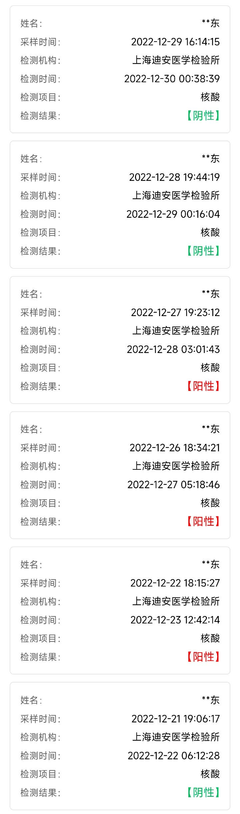
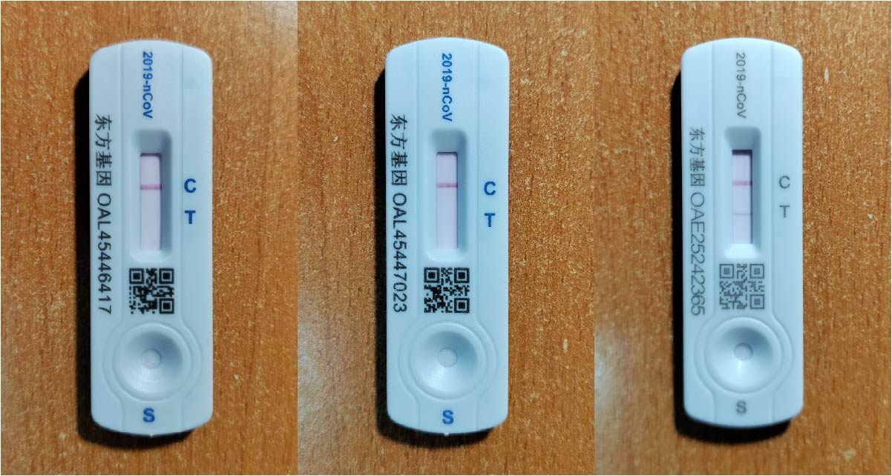
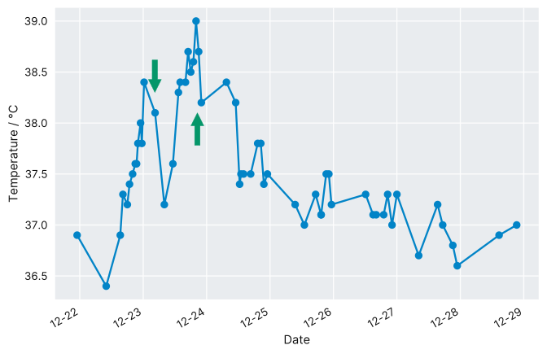

事情当然要从「双十一」开始说起。想不到打折力度最大的既不是天猫，也不是京东，而是国家卫健委[^20-measures]。随后的一个月在动荡中度过，场面堪比阿根廷对法国的那场决赛。政策来回拉扯，作为普通人唯有随波逐流。12 月 7 日又出「新十条」[^new-10-points]，放开的局面便再也收不住了。

<!-- more -->

[^20-measures]: 国务院联防联控机制. [关于进一步优化新冠肺炎疫情防控措施 科学精准做好防控工作的通知](http://www.nhc.gov.cn/xcs/yqfkdt/202211/ed9d123bbfe14e738402d846290049ea.shtml)
[^new-10-points]: 国务院联防联控机制. [关于进一步优化落实新冠肺炎疫情防控措施的通知](http://www.nhc.gov.cn/xcs/gzzcwj/202212/8278e7a7aee34e5bb378f0e0fc94e0f0.shtml)

这时后知后觉才开始囤药，但为时已晚，比较靠谱的退烧药都在缺货状态。当然事后证明其实退烧药并不需要太多，靠家人和同学的接济也基本够用（仅剩的一盒过期布洛芬最终也没派上用场）。某天夜里想起应该再备几支体温计，结果送到手上还碎了一根。

上海差不多落后北京一个身位。等到清北那儿「应阳尽阳」，我们这里的形势也开始不妙起来。每天都有疾控部门新的通知「XX 栋出现阳性病例」，而这时候居然还在搞转运。以这样的传播速度，转运的酒店、方舱或者所谓健康驿站没几天就满员了；之后便耗子尾汁，「做自己健康的第一责任人」。眼见着校园一天天萧条下去，仿佛躺在一个木头做的断头台下，明知它伤害有限，却还是忍不住焦虑。

办公室自然也非法外之地，几位回家的同学先后发烧，我们驻守的则又回到了每天不做下核酸嗓子就痒痒的状态。终于，21 号，我对面的同学蹲到了阳性的核酸结果；两天之后，我也阳了。

<figure>
  
  <figcaption>核酸检测记录</figcaption>
</figure>

## 症状

- Day 0（12 月 22 日）：昨天做的核酸结果还是阴性，但明显嗓子发干，觉也没睡好。下午开始体温慢慢攀升，晚上就到了 38 度。确认中招之后反而不那么焦虑了，不过发热之后依然睡不安稳，躺在床上辗转反侧到四点多，觉得还是吃一片退烧药比较好。再上床之后感觉有些出汗，这才渐渐睡着。
- Day 1（23 日）：核酸结果确认了新冠（抗原仍然是阴性），开始寝室「隔离」生活。退烧药的效果一直维持到中午，下午又回到了 38，晚上甚至到 39，达到体温巅峰。强行调整回阳间作息，十点就睡。睡前再吃退烧药，似乎舒服了不少。感觉有点胸痛，但血氧一直正常，可能只是心理因素。
- Day 2（24 日）：室友也出现了症状，大概率是我传染的。抗原还坚守在一条杠，体温则从中午开始降，在 37.5 附近徘徊。食欲一直不好，而中午竟然点到了麦当劳，在外卖一大半歇业、平均一小时起步的时候是运气爆棚，算是平安夜的福利了。
- Day 3（25 日）：起床后觉得嗓子疼，加上一些轻微的咳嗽。体温维持在 37.3 左右，也还有些头晕。下午做掉了手边最后一根抗原，终于变成了两条线。不过 T 线比较细，不知是因为本来病毒载量就不高，还是已经恢复差不多了的原因。
- Day 4（26 日）：症状和前一天相同，体温略降。晚上洗头洗澡，注意保暖的话也应当是比较安全的。今天甚至还开了组会，但既然阳了，就心安理得地摆烂。
- Day 5（27 日）：体温首次降到 37 度以下，几乎可以断定回到了正常状态，只有核酸还在提醒我依然是一个阳性。鼻塞有些加重，但属于完全能够接受的程度。
- Day 6（28 日）：症状维持，温度也不需要再监测了。室友表示嗅觉有些不灵，也有可能是鼻塞导致的，反正是种非常诡异的体验。
- Day 7（29 日）：我和室友昨天的核酸都回到了阴性，所有的症状都在减轻。下午出门散了会步，也基本没有出现任何不舒服的状况。
- Day 8（30 日）：连续两天核酸阴性，达到康复标准 🎉

<figure>
  
  <figcaption>23、24、25 三天的抗原记录</figcaption>
</figure>

国庆节的时候也发过一次烧，但抗原和核酸都是阴性，怀疑是流感。就我个人而言，新冠和流感的症状确实是很接近的，也都要一周左右的时间来恢复。

## 药物

退烧药只吃了两片泰诺林（对乙酰氨基酚缓释片，650 mg），对于缓解发热的不适还是有很大帮助的，尤其是在睡前。后期还吃了一点西瓜霜含片缓解嗓子痛，聊胜于无。其他症状都比较轻，也就没有吃别的药了。

<figure>
  <picture>
    <source srcset="./temperature.dark.svg" media="(prefers-color-scheme: dark)">
    
  </picture>
  <figcaption>体温变化情况，绿色箭头表示服用退烧药</figcaption>
</figure>

## 总结

身边人的症状大同小异，普遍都有发热、鼻塞、咳嗽、嗓子痛这些情况。朋友圈有人去了医院检查，所幸并无大碍。

短短半个月时间，学校估计有八成的人感染，又回忆起了曾经被腮腺炎、甲流支配的恐惧（少数几次因病停课的经历）。校园之外，医疗挤兑加上蔓延的恐慌情绪，这恐怕比传染病本身还要严重。疫情已有三年，只愿新的一年能迎来复苏的希望。

## 注释与参考

