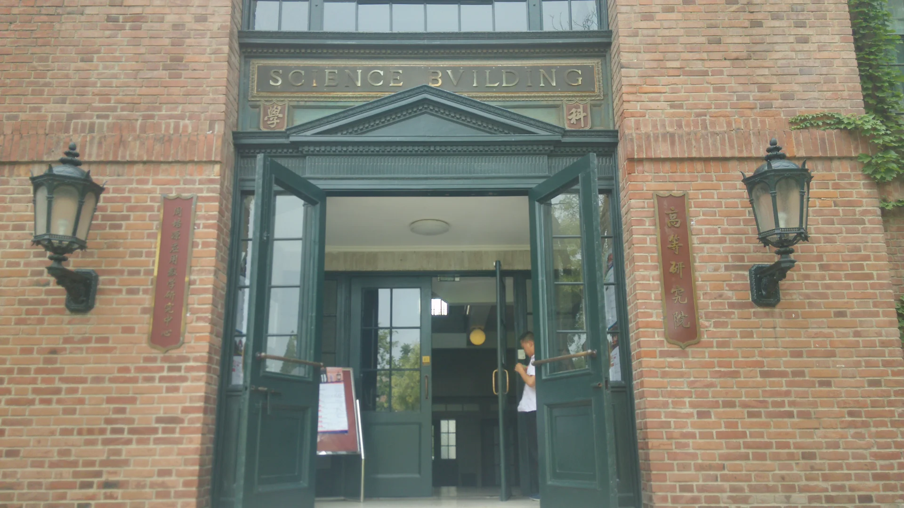

眼见着又到了一年开学季。从寒假（哦，现在只能叫春节假期了）拖到五一拖到毕业再拖到开学，终于还是抽出时间把这篇文章憋了出来。

<!-- more -->

## 开端

2017 年，大三下。那时我还在纠结到底是出国，还是留在国内读研。本科快要毕业的时候仍然对未来不知所措，而学校除了课本知识并不怎么教你别的，尤其是物理这种不面向实际应用的专业。我们系当时的保研比例大概是 30%，绩点 OK 一点的话并不是很大问题。纠结了一番之后，虽然报了托福，但还是决定不出国了。一是没有什么科研经历并不能申到好学校，二是感觉出国读博想 quit 的话也不好找退路。

可我还是觉得只留在本校多少有点「浪费」，就报了清华高等研究院的博士项目。高研是国内凝聚态理论的重镇，当时比较火的机器学习 + 重整化的方向也有老师在做。比起其他地方，高研的竞争不算激烈，但我还是面试挂黑板了。第二天出结果，果不其然没录。坐在高研的台阶上看七月的夕阳，有点不甘心，又对自己并不扎实的理论功底表示很无奈。

<figure>
  
  <figcaption>「科学馆是全国有志于科学报国的优秀青年心目中的圣殿」</figcaption>
</figure>

<!-- https://www.tsinghua.edu.cn/info/1360/1394.htm -->

之后回了上海，象征性地找几位老师要了推荐信，走本校保研的流程。于是大四便没有实质性的压力了，上课、做毕设、再毕业，就这样到了 2018 年的暑假。

## 沉淀

研一基本延续着本科的生活，还是上课为主。很多熟悉的同学还在本部，便三天两头往邯郸校区跑。但是这样的日子久了，慢慢却感觉迷茫了起来。就有点像最近沉迷其中的 Minecraft，虽然有一个主线任务（打败末影龙解放末地 vs 毕业并且拿到学位），但不看攻略想打下来几乎不可能；而主线任务之外的无尽可能（生电、红石、建筑、mod……），同样，全靠个人摸索也是异常艰难。

到下半学期，我还是没有想清楚具体该做什么方向；甚至更进一步，我开始想到底是不是还要继续做物理。课还是照上，助教还是照做，但文章却没有读不下去的欲望。看周围同学在不断前进，而我每天不知道在干什么，就真的非常焦虑。

有一天突然地特别想回家，我知道再这样下去确实不太行，便推了助教的活，跑到长海医院看了心理科。量表结果似乎是轻微抑郁 + 焦虑来着，但好在不严重，没到需要药物治疗的程度。出了医院，走到江湾体育场，看到放学的小孩在疯玩，一下子感到这种才是真实的世界（于是自此就养成了溜出来散步的习惯）。

心结还是要自己解开。当真的把退学当成一条路考虑的时候，很多问题也都不是问题了。逃避并不可耻，有时候也很有用。读书十几年的沉没成本看起来巨大，但和把自己搞崩溃相比并没有什么大不了。而最难过的反而是自己这一关，对于一个习惯于一路披荆斩棘的 PhD，要接受自己一事无成的事实（而不仅仅是嘴上说自己菜鸡）其实并不容易。

## 转机

我从大三大四的时候开始研究 LaTeX，日渐上头，又慢慢对字体产生了兴趣。那时恰逢 the type 最活跃的一段时间，在上海也能参与各种活动、认识很多有意思的人。于是我就开始考虑要不要转行。调研一番后，国内外的字体设计专业门槛都不低（好吧，国内其实并没有），还要设计类本科背景 + 作品集。同济有一个人工智能和设计交叉的专业，看起来跨专业考研也只有计算机方向的可以试一试了。便在刚考研失败的室友的鼓励下，买了四本书开始准备。

然而摆烂许久的我已经狠不下心来专心复习考研。明明身边有一条好走的路，只要顺利走完就有博士学位，却偏偏要选另一条还不知能不能走上的小路，更何况路的尽头是什么我也一无所知。

这种纠结之下，我看到了 3type 三言开办的[西文字体设计课](https://3type.cn/events/typeschool_1908_latin)。2018 年的暑假我就已经关注了，但当时还没有 mac 机，就只报了最后一天 Eric 刘庆的文瀛讲坛。2019 年换了电脑，也有了一点积蓄来负担上课的开销。将近两周的课，我做了[第一个比较完整的字体](https://github.com/stone-zeng/aluminium)，算是敲开了字体设计的大门。

真正的转机几个月之后才到来。三言的小伙伴们看到了我在技术层面能做点事情的能力，想拉我去做点工作，于是一拍即合。那天在陕西南路 7 号口，看到 dxy 和 cli 朝我走来：午后，初晴。浅浅的笑，温和的光线，覆下来，每一寸毛孔都因此通透了，都暖了。

之后就一直零零散散地做些 Glyphs 插件，三言的活动也可以蹭一蹭，直到疫情。

## 正经的科研居然到疫情才开始

TypeSchool 之后我反而没那么纠结了，也不再考虑考研（或者说终究是没有勇气彻底转行）。虽然正经的科研尚未开始，但毕竟看了点文章，还是有一些正反馈的。

20 年初疫情开始，这下可以光明正大在家摆烂，网课随意上反正有录像，作业到 ddl 前一晚再熬夜补，昼夜颠倒、~~精神错乱~~，新买的 iPad 最大作用便是玩游戏。五月份，老板问我最近怎么样，自然小半年毫无进展。不过她倒是给了一个新的问题，还约了几个合作者一块儿讨论。趁着这个机会申请了返校，毕竟在家实在是过于摆烂了。

那时我们组里的比较关心的话题主要有两块，其一是拓扑序和纠缠熵，其二则是张量网络和全息对偶。这个新的课题实际上是注意到了 Fendley 和 Verstraete 一群人的工作，可以通过所谓 strange correlator 把拓扑序映射到共形场论中。而共形场论由于其对称性可以严格地生长出全息张量网络，从而有可能来解决一些 AdS/CFT 的问题。而且一些拓扑序模型有具体的数据可以进行计算，即使解析上做不动，也可以跑一些数值的结果出来。

到暑假，我学习了一些 iTEBD、TRG 之类的张量网络算法，跑了几个 examples，初步验证了上面这种思路的可行性。紧接着准备 qualify 考试，电动 + 热统 + 量力的笔试和研究进展汇报，也算顺利。之后的很长一段时间都在调试代码中度过，至今仍记得因为漏了一个共轭至少花了一周时间去 debug。

再到 21 年，疫情的压力小了不少。我先是去中科大访问了几天，又跟着组里学长和来做毕设的学弟一块儿在深圳量子院呆了一个月，在孔良老师这边学到了不少（现在都忘掉了的）数学。不得不承认，地铁站里匆忙赶末班车的路人、到了周末就关门的小饭店、几乎没有历史的博物馆，深圳的确是一座属于奋斗者和打工人的城市。

## 2022·上海

转眼到了 2022 年，大的一直在来的路上。起先是五常的联合声明，紧接着冬奥会后没几天就爆发了俄乌战争。身边的疫情一刻也没消停过，西安的封锁刚刚解除，上海的形势又严峻了起来。

三月中旬，学校开始准封闭管理，也就是不准出校。我们这个校区从宿舍园区到主校园有条地道相连，因而两点一线的生活仍然继续。月底，学校里面检测出了阳性，于是从准封闭变成封闭，这下连宿舍楼也不能出了，一日三餐送到门口。21 年底其实也这么封过一次，但只有两天。谁能知道，这次一封就是两个月。

学校外面的世界其实更不太平。先是「鸳鸯锅」，封完浦东封浦西；然后一锅端，所有地方全部封。随后开始建方舱、选团长、抢物资，以及每日做核酸。象牙塔总归对学生有些优待，四月份伙食免费，五月份才象征性地收一点钱，还有后来根本不想吃的一堆水果零食。后来校内稍微稳定一点之后还有了放风时间，以及每天中午十二点开抢零食。公允地说，复旦在这段时间的管理倒还挺人性化，也是一代人特有的记忆了。

关在宿舍对我们不用做实验的人来说其实影响不大，只能把不想干活的责任推给压抑的情绪。不过我们还有远在美国的合作者，多亏了她我们才终于在五月份把文章投了出去，算是一个阶段性的小结。但这个工作（不出意料）被 PRL 拒了，最后只发在了 PRB，而按照我们系的规定这并不能算在我的毕业要求中，还得再有两篇文章才能毕业。

不过有了第一篇，第二篇其实就好办很多了。第一篇文章我们讨论了寻找 Virasoro 算符的基本框架，但只是在最简单的 Ising 和 dimer 模型中进行了验证，而对于更复杂的问题其实并没有给出具体方案。所以后面我们就尝试了一些新的东西，比如拓扑序里面的 Fibonacci 任意子。不像 Ising 随便跑一下就有很干净的结果，Fibonacci 只有用很大的系统来模拟才有比较靠谱的结果，而且还必须根据拓扑序的性质来进行简化。因此这篇文章主要就是各种技术细节，虽然和审稿人 battle 了半年，但我还是希望能给之后做相关工作的人提供一些微小的帮助。

## 在 ⚓️ 的日子

上面说到，我在三言混了没几个月就到疫情了。线下字体课被迫转为线上，但不用邀请嘉宾来现场，反而是一种机会。三言几乎是第一批开始做线上培训的设计工作室了。所以在整个 20 年，各种活动和项目填满了三言的日程表。我们办了五六场 TypeSchool 线上课，用学术化的思路做了很多字体方面的研究，还去（同样是线上的）AtypI 做了分享。最出圈的活儿还得数汉字重叠，也不知道为什么不管是公众号、知乎还是 b 站就莫名其妙地火了。

可好景不长。21 年初，几位小伙伴由于种种原因离开了三言，成立了新的工作室 [atelierAnchor 锚坞](https://atelier-anchor.com)。说到底，字体这一片小小的一亩三分地实在是太贫瘠了，没有商业项目的支持根本不足以维系工作室的生存。后面半年就两头跑；十月，我也彻底告别三言，开始领锚坞固定的实习工资。

在 ⚓️，我开始试着干一些前端的工作。当时的我对现代化的前端工程还一无所知，唯一的经验只有此个人网站。第一个版本的工作室官网，用的是 [Zola](https://www.getzola.org) 做静态网页生成，再配合 Bootstrap 完成设计稿。之后用同样的技术栈开始做丁卯的网站，但静态网站生成器的上限终归是不高的，于是我开始断断续续地学 Vue，先后用 Vue 和 Vitepress 重构了锚坞和丁卯的网站（后来又换成了 Nuxt，暂且按下不表）。

个人觉得前端最大的难点在于各种不断变化的工具链配置。Vue 本身一行代码就能丢到浏览器里面跑起来，可一旦要工程化，要支持 CSS、TypeScript、JSON 等各种东西，还要有良好的开发体验，各种配置就变得异常繁琐。何况当时还处在 Vue 2 到 Vue 3 的转型阵痛期，Vite 和 Tailwind 这种划时代的工具也刚初出茅庐，学习前端的过程就是踩坑的过程。

2022 年参与的网站项目就更多了，先后做了锦华明朝和络黑的展示页面，以及同济设创学院的毕业展网站。[锦华的网站](https://mallikatype.com/jinhua) 主要为了之后的众筹服务，比较简单，技术栈是 Vue 和 Tailwind。而络黑则要有意思得多，这个两轴可变的中文字体其实是我们另一位设计师 🍐 的毕业设计。三月的某一天，他问我能不能快速做一个 demo 页面，用浏览器抓陀螺仪角度改可变轴。那这就是调一下 [`DeviceMotionEvent`](https://developer.mozilla.org/en-US/docs/Web/API/DeviceMotionEvent) API 的小活，一个晚上就搞定。有了这个 demo，想法便越来越多，又加上了涟漪效果以及排版功能。后来封在家里，🍐 那边慢慢打磨字体和网站的设计，我也把网站迁移到了熟悉的 Vue。这个网站里面我们费了很多心血来做一些不那么引人注意却又很有意思（aka 自嗨）的点，比如手工实现的标点积压，根据深色 / 浅色微调字重和笔画对比，还有为了纪念 Noordzij 特别添加的鼠标 hover 效果。彼时，作为可变字体思想重要来源的 Gerrit Noordzij 老先生刚刚辞世；对 🍐 来说，这份毕业设计是来到上海十年的个人阶段性总结；而且我们还都封着。这个小小的网站也就有了独有的纪念意义。

同济设创的 [毕业设计展](https://tjdi.tongji.edu.cn/tags) 是封城的时候靠着 🍐 的校友人脉接到的活儿。本身这网站倒不复杂，但设计师的想法比较先锋和前卫，前端实现总要兼顾各种技术的局限，做起来就很吃力。后来我们兑现承诺加了一个能上传作品的管理后台（虽然找了外援帮忙），简历里能写的东西终于可以不再局限于纯前端页面了。

[TBA]
